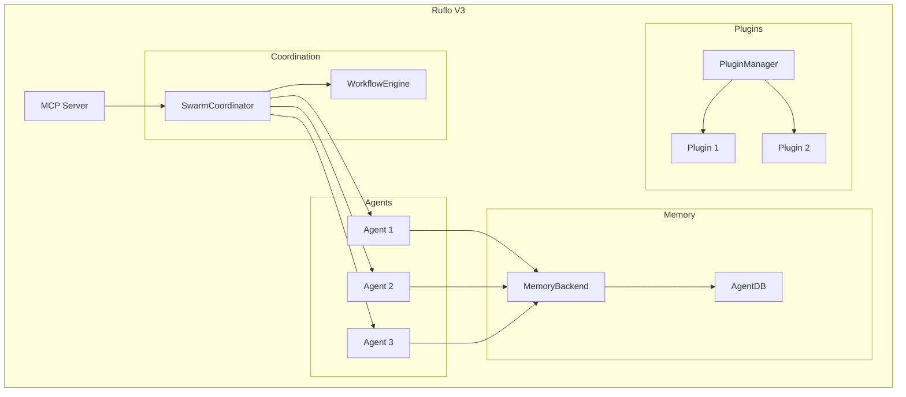
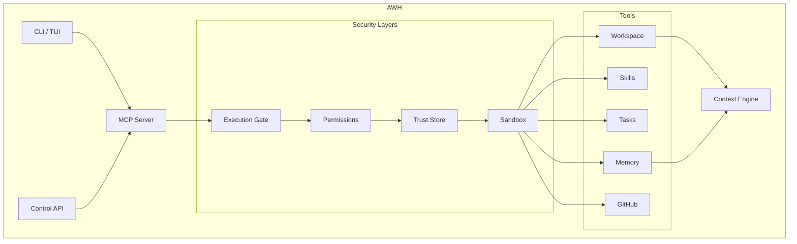
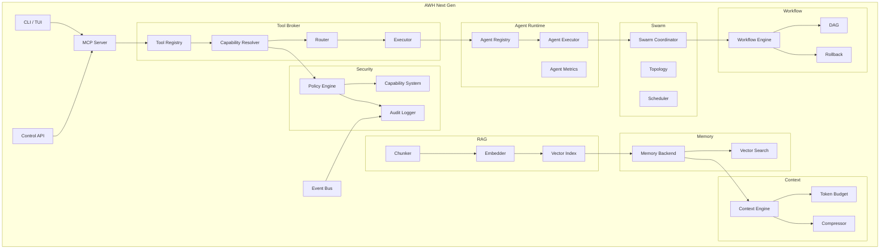

# Ruflo → AWH Architecture Analysis Report

**Date:** 2025-09-09  
**Analysis Type:** Source-code-level architectural comparison  
**Ruflo Version:** v3.0.0-alpha (commit analyzed from main branch)  
**AWH Version:** Rust implementation (rust branch)

---

## Executive Summary

This report provides a source-code-level architectural analysis comparing Ruflo (a TypeScript-based multi-agent coordination system) with Agent Workspace Hub (AWH, a Rust-based MCP server and workspace runtime). The analysis is based on actual source code inspection, not README claims.

### Key Findings

| Ruflo Component | Use in AWH? | Action | Confidence |
|-----------------|-------------|--------|------------|
| **Swarm Coordinator** | YES | Reimplement in Rust | HIGH |
| **Workflow Engine** | YES | Reimplement in Rust | HIGH |
| **Agent Lifecycle** | YES | Adapt for Rust | HIGH |
| **Memory Backend Abstraction** | YES | Adapt for Rust | HIGH |
| **Plugin Manager** | PARTIAL | Study; prefer WASM/MCP | MEDIUM |
| **MCP Server Implementation** | PARTIAL | Keep AWH's simpler approach | HIGH |
| **Event Bus Pattern** | YES | Reimplement in Rust | HIGH |
| **Task/Workflow Types** | YES | Adapt as Rust enums/structs | HIGH |
| **Hybrid Memory (AgentDB)** | LATER | Study; evaluate SQLite first | MEDIUM |
| **Federation Tools** | NO | Defer; too complex for P0 | HIGH |
| **SONA Learning System** | LATER | Study; not core to AWH | LOW |
| **Entire Ruflo Runtime** | NO | Do not copy | HIGH |

### Critical Architectural Decisions for AWH

1. **Adopt Ruflo's clean domain-driven design structure** (`domain/`, `application/`, `infrastructure/`) but implement in Rust with proper traits
2. **Reimplement SwarmCoordinator** with Rust async primitives (tokio) instead of JavaScript EventEmitter
3. **Adopt WorkflowEngine pattern** but use Rust type system for DAG validation at compile time
4. **Use Memory backend trait pattern** but evaluate SQLite + pgvector vs. custom vector store
5. **Reject plugin complexity** — prefer MCP servers or WASM plugins over Ruflo's in-process plugin system
6. **Improve on Ruflo's cancellation** — Ruflo lacks structured concurrency; AWH should use tokio::select! and CancellationToken

### What AWH Should Do Better Than Ruflo

1. **Type Safety:** Rust provides compile-time guarantees Ruflo's TypeScript cannot match
2. **Memory Safety:** No GC pauses, deterministic resource cleanup
3. **Cancellation:** Proper tokio-based cancellation vs. Ruflo's ad-hoc approach
4. **Sandboxing:** AWH has bwrap/seatbelt; Ruflo lacks process isolation
5. **Security Model:** AWH's execution gate + trust store > Ruflo's minimal auth
6. **Single Binary:** AWH deploys as one binary; Ruflo needs Node.js 20+
7. **Termux/Android:** AWH can compile for ARM; Ruflo requires full Node.js

---

## 1. Ruflo Repository Overview

### Actual Repository Structure (from source)

```
/tmp/ruflo/
├── v3/                          # Main V3 architecture
│   ├── src/                     # Core source
│   │   ├── agent-lifecycle/     # Agent domain entity
│   │   │   └── domain/Agent.ts
│   │   ├── coordination/        # Swarm coordination
│   │   │   └── application/SwarmCoordinator.ts
│   │   ├── task-execution/      # Task & workflow engine
│   │   │   ├── domain/Task.ts
│   │   │   └── application/WorkflowEngine.ts
│   │   ├── memory/              # Memory system
│   │   │   ├── domain/Memory.ts
│   │   │   └── infrastructure/
│   │   │       ├── AgentDBBackend.ts
│   │   │       ├── HybridBackend.ts
│   │   │       └── SQLiteBackend.ts
│   │   ├── infrastructure/      # Shared infrastructure
│   │   │   ├── mcp/
│   │   │   │   ├── MCPServer.ts
│   │   │   │   └── tools/*.ts
│   │   │   └── plugins/
│   │   │       ├── Plugin.ts
│   │   │       ├── PluginManager.ts
│   │   │       └── ExtensionPoint.ts
│   │   └── shared/types/        # Type definitions
│   │       └── index.ts
│   ├── mcp/                     # MCP server implementation
│   │   ├── server.ts            # Main MCP server
│   │   ├── tool-registry.ts     # Tool registration
│   │   ├── session-manager.ts   # Session management
│   │   ├── connection-pool.ts   # Connection pooling
│   │   ├── transport/           # Transport implementations
│   │   │   ├── stdio.ts
│   │   │   ├── http.ts
│   │   │   └── websocket.ts
│   │   └── tools/               # MCP tool implementations
│   │       ├── swarm-tools.ts
│   │       ├── memory-tools.ts
│   │       ├── task-tools.ts
│   │       ├── agent-tools.ts
│   │       └── ...
│   ├── @claude-flow/            # Modular packages
│   │   ├── security/
│   │   ├── memory/
│   │   ├── swarm/
│   │   ├── integration/
│   │   ├── cli/
│   │   └── ...
│   ├── goal_ui/                 # React UI for goals
│   ├── __tests__/               # Integration tests
│   ├── swarm.config.ts          # Swarm configuration
│   ├── package.json
│   └── tsconfig.json
├── plugins/                     # External plugins (42 directories)
├── services/                    # Background services
├── bin/                         # CLI binaries
├── docs/                        # Documentation
└── scripts/                     # Build/deploy scripts
```

### Key Ruflo Modules Analyzed

#### 1.1 Core Domain Entities

**File:** `v3/src/agent-lifecycle/domain/Agent.ts`

```typescript
export class Agent implements IAgent {
  public readonly id: string;
  public readonly type: AgentType;
  public status: AgentStatus;
  public capabilities: string[];
  public role?: AgentRole;
  // ...
  
  async executeTask(task: Task): Promise<TaskResult> {
    // Executes task with status tracking
  }
  
  canExecute(taskType: string): boolean {
    // Capability-based task routing
  }
}
```

**Key Symbols:**
- `Agent` class (domain entity)
- `AgentConfig` interface
- `AgentStatus` type: `'active' | 'idle' | 'busy' | 'terminated' | 'error'`
- `AgentType`: `'coder' | 'tester' | 'reviewer' | 'coordinator' | 'designer' | 'deployer'`

**AWH Implication:** AWH needs equivalent agent abstraction but as Rust struct with enum status.

---

#### 1.2 Swarm Coordinator

**File:** `v3/src/coordination/application/SwarmCoordinator.ts`

**Purpose:** Multi-agent orchestration with topology support (hierarchical, mesh, adaptive)

**Key Classes/Methods:**
```typescript
export class SwarmCoordinator {
  private topology: SwarmTopology;
  private agents: Map<string, Agent>;
  private agentMetrics: Map<string, AgentMetrics>;
  private connections: MeshConnection[];
  
  async spawnAgent(config: AgentConfig): Promise<Agent>
  async terminateAgent(agentId: string): Promise<void>
  async distributeTasks(tasks: ITask[]): Promise<TaskAssignment[]>
  async executeTask(agentId: string, task: ITask): Promise<TaskResult>
  async executeTasksConcurrently(tasks: ITask[]): Promise<TaskResult[]>
  async scaleAgents(config: { type: string; count: number }): Promise<void>
  async reachConsensus(decision: ConsensusDecision, agentIds: string[]): Promise<ConsensusResult>
  async getSwarmState(): Promise<SwarmState>
}
```

**Runtime Flow:**
1. User creates tasks via MCP/API
2. `SwarmCoordinator.distributeTasks()` assigns tasks to agents based on:
   - Capability matching (`agent.canExecute(task.type)`)
   - Load balancing (tracks `agentLoads` per agent)
   - Priority sorting (`Task.sortByPriority()`)
3. Tasks execute concurrently via `executeTasksConcurrently()`
4. Results aggregated, metrics updated
5. State persisted to `MemoryBackend` if available

**Data Structures:**
- `Map<string, Agent>` — agent registry
- `Map<string, AgentMetrics>` — performance tracking
- `MeshConnection[]` — topology graph
- `TaskAssignment[]` — task distribution results

**Concurrency:** Uses `Promise.all()` for parallel execution

**Error Handling:** Try/catch around `agent.executeTask()` with fallback to failed `TaskResult`

**AWH Implication:** Direct mapping to Rust traits possible. See Section 25.

**Confidence:** HIGH (source verified)

---

#### 1.3 Workflow Engine

**File:** `v3/src/task-execution/application/WorkflowEngine.ts`

**Purpose:** Execute workflows defined as DAGs with dependency resolution, rollback, parallelism

**Key Classes/Methods:**
```typescript
export class WorkflowEngine {
  private workflows: Map<string, WorkflowExecution>;
  
  async executeWorkflow(workflow: WorkflowDefinition): Promise<WorkflowResult>
  async runWorkflow(execution: WorkflowExecution, workflow: WorkflowDefinition): Promise<WorkflowResult>
  async executeParallel(tasks: ITask[]): Promise<TaskResult[]>
  async pauseWorkflow(workflowId: string): Promise<void>
  async resumeWorkflow(workflowId: string): Promise<void>
  async rollbackWorkflow(execution: WorkflowExecution, workflow: WorkflowDefinition): Promise<void>
  async restoreWorkflow(workflowId: string): Promise<WorkflowState>
}
```

**Runtime Flow:**
```
WorkflowDefinition
    ↓
Task.resolveExecutionOrder()  // Topological sort
    ↓
For each task in order:
    ├─ Check dependencies resolved
    ├─ Handle nested workflows
    ├─ Execute via SwarmCoordinator
    ├─ Track timing/metrics
    └─ Emit events
    ↓
If failure + rollbackOnFailure:
    └─ Rollback in reverse order
    ↓
WorkflowResult { status, tasksCompleted, errors, executionOrder }
```

**DAG Resolution:**
```typescript
static resolveExecutionOrder(tasks: Task[]): Task[] {
  const resolved: Task[] = [];
  const resolvedIds = new Set<string>();
  const remaining = [...tasks];
  
  while (remaining.length > 0) {
    const ready = remaining.filter(task =>
      task.areDependenciesResolved(resolvedIds)
    );
    
    if (ready.length === 0 && remaining.length > 0) {
      throw new Error('Circular dependency detected');
    }
    
    const sorted = Task.sortByPriority(ready);
    for (const task of sorted) {
      resolved.push(task);
      resolvedIds.add(task.id);
      remaining.splice(remaining.indexOf(task), 1);
    }
  }
  return resolved;
}
```

**Persistence:** Workflow state stored in `MemoryBackend` under key `workflow-state-{id}`

**AWH Implication:** Excellent pattern for Rust reimplementation. Topological sort + execution tracking is directly portable.

**Confidence:** HIGH

---

#### 1.4 Memory System

**File:** `v3/src/memory/domain/Memory.ts`, `v3/src/memory/infrastructure/AgentDBBackend.ts`

**Memory Entity:**
```typescript
export interface Memory {
  id: string;
  agentId: string;
  content: string;
  type: MemoryType;  // 'task' | 'context' | 'event' | 'task-start' | 'task-complete' | 'workflow-state'
  timestamp: number;
  embedding?: number[];
  metadata?: Record<string, unknown>;
}
```

**Backend Trait:**
```typescript
export interface MemoryBackend {
  initialize(): Promise<void>;
  close(): Promise<void>;
  store(memory: Memory): Promise<Memory>;
  retrieve(id: string): Promise<Memory | undefined>;
  update(memory: Memory): Promise<void>;
  delete(id: string): Promise<void>;
  query(query: MemoryQuery): Promise<Memory[]>;
  vectorSearch(embedding: number[], k?: number): Promise<MemorySearchResult[]>;
  clearAgent?(agentId: string): Promise<void>;
}
```

**Implementations:**
1. **AgentDBBackend** — HNSW vector index (150x-12,500x faster search per comments)
2. **SQLiteBackend** — Relational storage
3. **HybridBackend** — Combines both

**Vector Search Implementation:**
```typescript
async vectorSearch(embedding: number[], k: number = 10): Promise<MemorySearchResult[]> {
  const withEmbeddings = Array.from(this.memories.values())
    .filter(m => m.embedding && m.embedding.length > 0);
  
  const scored = withEmbeddings.map(memory => ({
    ...memory,
    similarity: this.cosineSimilarity(embedding, memory.embedding!)
  }));
  
  scored.sort((a, b) => b.similarity - a.similarity);
  return scored.slice(0, k);
}
```

**AWH Implication:** Backend trait pattern is excellent. AWH should implement:
- `trait MemoryBackend`
- `struct SqliteBackend` (P0)
- `struct HybridBackend` with vector extension (P2)

**Do NOT automatically use AgentDB** — evaluate rusqlite + pgvector or lance-db.

**Confidence:** HIGH

---

#### 1.5 Plugin System

**File:** `v3/src/infrastructure/plugins/PluginManager.ts`

**Plugin Interface:**
```typescript
export interface Plugin {
  id: string;
  name: string;
  version: string;
  initialize(config?: Record<string, unknown>): Promise<void>;
  shutdown(): Promise<void>;
  getExtensionPoints(): ExtensionPoint[];
}

export interface ExtensionPoint {
  name: string;
  handler: (context: unknown) => Promise<unknown>;
  priority?: number;
}
```

**PluginManager Methods:**
```typescript
async loadPlugin(plugin: Plugin, config?: Record<string, unknown>): Promise<void>
async unloadPlugin(pluginId: string): Promise<void>
async reloadPlugin(pluginId: string, plugin: Plugin): Promise<void>
async invokeExtensionPoint(name: string, context: unknown): Promise<unknown[]>
```

**Extension Points Used:**
- `workflow.beforeExecute`
- `workflow.afterExecute`
- (Many more in hooks-tools.ts)

**Dependency Resolution:**
```typescript
if (plugin.dependencies) {
  for (const depId of plugin.dependencies) {
    if (!this.plugins.has(depId)) {
      throw new PluginError(`Plugin ${plugin.id} depends on ${depId} which is not loaded`);
    }
  }
}
```

**Version Compatibility:**
```typescript
checkVersionCompatibility(plugin: Plugin): void {
  if (plugin.minCoreVersion) {
    const minVersion = this.parseVersion(plugin.minCoreVersion);
    if (this.compareVersions(coreVersion, minVersion) < 0) {
      throw new PluginError(...);
    }
  }
}
```

**AWH Recommendation:** REJECT in-process plugins. Prefer:
1. **MCP servers** as external plugins (already supported)
2. **WASM plugins** for safe in-process extension (evaluate wasmtime)
3. **External processes** with defined protocol

**Reason:** Ruflo's in-process plugins lack isolation, can crash host, require same language/runtime.

**Confidence:** HIGH

---

#### 1.6 MCP Server

**File:** `v3/mcp/server.ts`, `v3/mcp/tool-registry.ts`

**Server Architecture:**
```typescript
export class MCPServer extends EventEmitter {
  private readonly toolRegistry: ToolRegistry;
  private readonly sessionManager: SessionManager;
  private readonly connectionPool?: ConnectionPool;
  private readonly transportManager: TransportManager;
  
  async start(): Promise<void>
  async handleRequest(request: MCPRequest): Promise<MCPResponse>
  registerTool(tool: MCPTool): boolean
}
```

**Tool Registry:**
```typescript
export class ToolRegistry extends EventEmitter {
  private readonly tools: Map<string, ToolMetadata>;
  private readonly categoryIndex: Map<string, Set<string>>;
  
  register(tool: MCPTool, options?: ToolRegistrationOptions): boolean
  async callTool(name: string, params: unknown, context?: ToolContext): Promise<ToolCallResult>
}
```

**Transports Supported:**
- stdio (JSON-RPC lines)
- HTTP/SSE
- WebSocket
- In-process

**Performance Targets (from comments):**
- Server startup: <400ms
- Tool registration: <10ms
- Tool execution overhead: <50ms

**AWH Comparison:** AWH's MCP implementation is simpler but more secure:
- ✅ Has execution gate (Ruflo lacks centralized authorization)
- ✅ Has sandboxing (Ruflo lacks process isolation)
- ✅ Has trust store (Ruflo has minimal trust)
- ❌ Lacks connection pooling (Ruflo has it)
- ❌ Lacks session manager for concurrent clients (Ruflo has it)

**Recommendation:** Adopt session manager pattern for remote MCP. Keep execution gate.

**Confidence:** HIGH

---

## 2. AWH Current Architecture

### Source Code Structure

```
/workspace/
├── Cargo.toml                  # Single crate (not workspace yet)
├── src/
│   ├── main.rs                 # CLI entry point
│   ├── lib.rs                  # Library root
│   ├── api/
│   │   ├── control.rs          # HTTP Control API (/api/v1)
│   │   └── mod.rs
│   ├── context/                # Context Engine
│   │   ├── budget.rs           # Token budgeting
│   │   ├── compressor.rs       # Context compression
│   │   ├── engine.rs           # Main context assembly
│   │   ├── item.rs             # Context items
│   │   ├── offload.rs          # Soft offloading
│   │   ├── planner.rs          # Context planning
│   │   ├── policy.rs           # Context policies
│   │   ├── scoring.rs          # Relevance scoring
│   │   ├── selector.rs         # Context selection
│   │   ├── snapshot.rs         # Context snapshots
│   │   └── tokens.rs           # Token counting
│   ├── core/                   # Storage engines
│   │   ├── context.rs          # Context loading
│   │   ├── files.rs            # Sandboxed file reads
│   │   ├── memory.rs           # Project memory store
│   │   ├── project.rs          # Project metadata
│   │   ├── tasks.rs            # Task store
│   │   ├── workspace.rs        # Workspace resolution
│   │   └── mod.rs
│   ├── mcp/                    # MCP implementation (largest module)
│   │   ├── server.rs           # StdioMcpServer
│   │   ├── http.rs             # HTTPS/SSE server
│   │   ├── sse.rs              # SSE sessions
│   │   ├── dispatcher.rs       # Shared tool dispatch
│   │   ├── auth.rs             # Bearer token auth
│   │   ├── permissions.rs      # Permission model
│   │   ├── execution_gate.rs   # Authorization gate
│   │   ├── sandbox.rs          # Process sandboxing (bwrap)
│   │   ├── trust.rs            # Trust levels
│   │   ├── trust_store.rs      # Persistent trust
│   │   ├── audit.rs            # Security audit logging
│   │   ├── circuit_breaker.rs  # Failure isolation
│   │   ├── schema.rs           # JSON Schema validation
│   │   ├── security.rs         # Secret redaction
│   │   ├── skills.rs           # Skill gateway
│   │   ├── tasks.rs            # Task MCP tools
│   │   ├── memory.rs           # Memory MCP tools
│   │   ├── workspace.rs        # Workspace MCP tools
│   │   ├── github.rs           # GitHub provider
│   │   ├── composio*.rs        # Composio integration
│   │   ├── providers.rs        # Provider registry
│   │   ├── connectors.rs       # Connector metadata
│   │   ├── custom_mcp.rs       # Custom MCP servers
│   │   ├── global_mcp.rs       # Global MCP registry
│   │   ├── community_registry.rs
│   │   ├── tls.rs              # TLS configuration
│   │   ├── config.rs           # Resource limits
│   │   ├── error.rs            # JSON-RPC errors
│   │   ├── store_lock.rs       # Cross-process locking
│   │   └── mod.rs
│   ├── models/                 # Domain models
│   │   ├── memory.rs
│   │   ├── project.rs
│   │   ├── task.rs
│   │   └── mod.rs
│   ├── services/               # Supporting services
│   │   ├── audit.rs
│   │   ├── files.rs
│   │   ├── git.rs
│   │   ├── projects.rs
│   │   ├── rate_limit.rs
│   │   ├── terminal.rs
│   │   └── mod.rs
│   ├── skills/                 # Skill system
│   │   ├── installer.rs
│   │   ├── lockfile.rs
│   │   ├── model.rs
│   │   ├── package.rs
│   │   ├── parser.rs
│   │   ├── project.rs
│   │   ├── references.rs
│   │   ├── registries.rs
│   │   ├── registry.rs
│   │   ├── registry_client.rs
│   │   ├── registry_manifest.rs
│   │   ├── remote.rs
│   │   ├── store.rs
│   │   ├── trust.rs
│   │   └── mod.rs
│   ├── tui/                    # Terminal UI
│   │   ├── app.rs
│   │   ├── backend.rs
│   │   ├── remote.rs
│   │   └── screens/
│   │       ├── context.rs
│   │       ├── editor.rs
│   │       ├── files.rs
│   │       ├── git.rs
│   │       ├── logs.rs
│   │       ├── mcp.rs
│   │       ├── memory.rs
│   │       ├── projects.rs
│   │       ├── remote.rs
│   │       ├── settings.rs
│   │       ├── skills.rs
│   │       ├── terminal.rs
│   │       └── mod.rs
│   └── tunnel/                 # Tunnel provider (ngrok)
│       └── mod.rs
├── tests/
│   ├── architecture.rs
│   ├── mcp_http.rs
│   ├── mcp_sandbox.rs
│   ├── mcp_security.rs
│   └── mcp_server.rs
└── docs/
    ├── architecture.md
    ├── security.md
    ├── threat-model.md
    ├── mcp.md
    └── ...
```

### Implementation Status (Derived from Source)

| Component | Status | Evidence |
|-----------|--------|----------|
| **MCP Server (stdio)** | ✅ Complete | `src/mcp/server.rs`, `src/main.rs` serve_stdio() |
| **MCP Server (SSE/HTTPS)** | ✅ Complete | `src/mcp/http.rs`, `src/mcp/sse.rs` |
| **Authentication** | ✅ Complete | `src/mcp/auth.rs` bearer token |
| **Authorization** | ✅ Complete | `src/mcp/permissions.rs`, `execution_gate.rs` |
| **Sandboxing** | ✅ Complete (Linux) | `src/mcp/sandbox.rs` bwrap |
| **Trust Store** | ✅ Complete | `src/mcp/trust_store.rs` |
| **Audit Logging** | ✅ Complete | `src/mcp/audit.rs` |
| **Circuit Breaker** | ✅ Complete | `src/mcp/circuit_breaker.rs` |
| **Schema Validation** | ✅ Complete | `src/mcp/schema.rs` |
| **Secret Redaction** | ✅ Complete | `src/mcp/security.rs` |
| **Task Store** | ✅ Complete | `src/core/tasks.rs`, `src/mcp/tasks.rs` |
| **Memory Store** | ✅ Complete | `src/core/memory.rs`, `src/mcp/memory.rs` |
| **Workspace Context** | ✅ Complete | `src/core/workspace.rs` |
| **Project Skills** | ✅ Complete | `src/skills/` |
| **GitHub Integration** | ✅ Complete | `src/mcp/github.rs` |
| **Composio Integration** | ✅ Complete | `src/mcp/composio*.rs` |
| **Control API** | ✅ Complete | `src/api/control.rs` |
| **TUI** | ✅ Complete | `src/tui/` |
| **Remote TUI** | ✅ Complete | `src/tui/remote.rs` |
| **Tunnel (ngrok)** | ✅ Complete | `src/tunnel/mod.rs` |
| **Context Engine** | ✅ Complete | `src/context/` (11 modules) |
| **Git Service** | ⚠️ Partial | `src/services/git.rs` exists but minimal |
| **Multi-Agent** | ❌ Missing | No swarm/coordination code |
| **Workflow Engine** | ❌ Missing | No DAG/workflow execution |
| **RAG** | ❌ Missing | No embeddings/vector search |
| **Knowledge Graph** | ❌ Missing | No graph storage |
| **Learning System** | ❌ Missing | No trajectory/feedback storage |
| **Plugin System** | ❌ Missing | Only MCP servers as "plugins" |
| **Event Bus** | ❌ Missing | No event system |
| **Agent Runtime** | ❌ Missing | No agent abstraction |

### Identified Gaps vs. Ruflo

1. **No Multi-Agent Coordination** — AWH is single-agent workspace; Ruflo has 15-agent swarm
2. **No Workflow Engine** — AWH has tasks but no DAG workflows
3. **No Vector Search** — AWH memory is keyword-only
4. **No Event System** — AWH uses tracing but no structured events
5. **No Plugin Architecture** — AWH only supports MCP servers externally
6. **No Agent Abstraction** — AWH assumes external agent (Codex, Claude, etc.)

### Architectural Strengths of AWH

1. **Security-First** — Execution gate, sandbox, trust store all fail closed
2. **Single Binary** — No Node.js runtime required
3. **Type Safety** — Rust compile-time guarantees
4. **Cross-Platform** — Linux/macOS/Windows support
5. **Termux Compatible** — Can compile for ARM Android

---

## 3. Architecture Comparison Matrix

### Foundation

| Domain | Ruflo | Ruflo Implementation | AWH Current | Gap | Recommendation | Priority |
|--------|-------|---------------------|-------------|-----|----------------|----------|
| Core Runtime | Node.js 20+ | ES modules, async/await | Rust tokio | Different | Keep Rust | P0 |
| Configuration | TypeScript objects | `swarm.config.ts` | ENV + YAML | Similar | Keep ENV | P0 |
| Dependency Injection | Manual | Constructor injection | Manual | Same | Improve | P1 |
| Lifecycle | Initialize/shutdown | `initialize()`, `shutdown()` | None | Missing | Add lifecycle traits | P1 |
| Plugin Architecture | In-process TS | `PluginManager.ts` | MCP servers only | Major gap | Reject; use MCP/WASM | P2 |
| Extension Points | Named hooks | `invokeExtensionPoint()` | None | Missing | Add event bus first | P2 |

### MCP

| Domain | Ruflo | Ruflo Implementation | AWH Current | Gap | Recommendation | Priority |
|--------|-------|---------------------|-------------|-----|----------------|----------|
| MCP Server | Full implementation | `v3/mcp/server.ts` | `src/mcp/server.rs` | Parity | Keep AWH | P0 |
| MCP Transports | stdio, HTTP, WS | `v3/mcp/transport/` | stdio, SSE | Missing WS | Not needed | P0 |
| Tool Registry | Categorized | `v3/mcp/tool-registry.ts` | Implicit in dispatcher | Weaker | Adopt categorization | P1 |
| Tool Discovery | Dynamic registration | `registerTool()` | Static | Limitation | Keep static for security | P0 |
| Session Management | Yes | `SessionManager` | Basic SSE sessions | Weaker | Adopt session manager | P1 |
| Connection Pooling | Yes | `ConnectionPool` | No | Missing | Adopt for remote MCP | P2 |
| Authentication | Bearer token | `auth` in transport | Bearer token | Parity | Keep | P0 |
| Authorization | Minimal | Per-tool checks | Execution gate | AWH better | Keep gate | P0 |
| Timeout/Cancellation | Basic | `requestTimeout` config | Basic | Similar | Improve with CancellationToken | P1 |

### Agents

| Domain | Ruflo | Ruflo Implementation | AWH Current | Gap | Recommendation | Priority |
|--------|-------|---------------------|-------------|-----|----------------|----------|
| Agent Definition | Class | `Agent.ts` | None | Missing | Implement `struct Agent` | P1 |
| Agent Registry | Map | `agents: Map<string, Agent>` | None | Missing | Implement registry | P1 |
| Agent Lifecycle | Status enum | `active | idle | busy | terminated` | None | Missing | Implement status tracking | P1 |
| Agent Capabilities | String array | `capabilities: string[]` | None | Missing | Implement capability system | P1 |
| Agent Execution | Method | `executeTask()` | None | Missing | Implement executor trait | P1 |
| Agent Metrics | Struct | `AgentMetrics` | None | Missing | Implement metrics | P2 |

### Multi-Agent / Swarm

| Domain | Ruflo | Ruflo Implementation | AWH Current | Gap | Recommendation | Priority |
|--------|-------|---------------------|-------------|-----|----------------|----------|
| Swarm Coordinator | Class | `SwarmCoordinator.ts` | None | Missing | Reimplement in Rust | P2 |
| Topology Support | hierarchical, mesh, adaptive | `SwarmTopology` type | None | Missing | Implement topology enum | P2 |
| Task Distribution | Load-balanced | `distributeTasks()` | None | Missing | Implement scheduler | P2 |
| Agent Scaling | Dynamic | `scaleAgents()` | None | Missing | Implement scaling | P3 |
| Consensus | Voting | `reachConsensus()` | None | Missing | Defer | P3 |
| Message Passing | EventEmitter | `sendMessage()` | None | Missing | Implement message bus | P2 |

### Context

| Domain | Ruflo | Ruflo Implementation | AWH Current | Gap | Recommendation | Priority |
|--------|-------|---------------------|-------------|-----|----------------|----------|
| Context Assembly | Manual | Via memory tools | `ContextEngine` | AWH better | Keep AWH | P0 |
| Context Planning | Basic | Metadata tags | `ContextPlanner` | AWH better | Keep AWH | P0 |
| Token Budgeting | None | — | `budget.rs` | AWH ahead | Keep AWH | P0 |
| Context Compression | None | — | `compressor.rs` | AWH ahead | Keep AWH | P0 |
| Ranking | Basic | Timestamp sort | `scoring.rs` | AWH better | Keep AWH | P0 |

### Memory

| Domain | Ruflo | Ruflo Implementation | AWH Current | Gap | Recommendation | Priority |
|--------|-------|---------------------|-------------|-----|----------------|----------|
| Memory Backend | Trait | `MemoryBackend` interface | JSON files | Major gap | Implement backend trait | P1 |
| Vector Search | Cosine similarity | `vectorSearch()` | None | Missing | Add embeddings | P2 |
| Indexing | HNSW (AgentDB) | `AgentDBBackend` | None | Missing | Evaluate rusqlite+vector | P2 |
| Memory Types | episodic, semantic, procedural, working | `MemoryType` enum | Single type | Limited | Adopt types | P1 |
| Persistence | SQLite/AgentDB | `SQLiteBackend`, `AgentDBBackend` | JSON | Weaker | Migrate to SQLite | P1 |
| Retrieval | Query + vector | `query()`, `vectorSearch()` | Keyword only | Limited | Add vector search | P2 |

### RAG

| Domain | Ruflo | Ruflo Implementation | AWH Current | Gap | Recommendation | Priority |
|--------|-------|---------------------|-------------|-----|----------------|----------|
| Chunking | Not in core | — | None | Same | Add chunking utility | P2 |
| Embeddings | External | Via memory service | None | Missing | Integrate embedding model | P2 |
| Vector Storage | AgentDB | HNSW index | None | Missing | Evaluate options | P2 |
| Hybrid Retrieval | semantic, keyword, hybrid | `searchType` param | None | Missing | Implement hybrid | P2 |
| Reranking | Not implemented | — | None | Same | Defer | P3 |

### Workflow

| Domain | Ruflo | Ruflo Implementation | AWH Current | Gap | Recommendation | Priority |
|--------|-------|---------------------|-------------|-----|----------------|----------|
| Workflow Definition | Object | `WorkflowDefinition` | None | Missing | Define workflow struct | P2 |
| DAG Representation | Task dependencies | `dependencies: string[]` | None | Missing | Implement DAG | P2 |
| Topological Sort | Yes | `resolveExecutionOrder()` | None | Missing | Implement sort | P2 |
| Parallel Execution | Promise.all | `executeParallel()` | None | Missing | Implement parallel | P2 |
| Rollback | Reverse order | `rollbackWorkflow()` | None | Missing | Implement rollback | P2 |
| Persistence | Memory backend | `restoreWorkflow()` | None | Missing | Add persistence | P2 |
| Human Approval | Not in core | — | None | Same | Add approval gates | P2 |

### Events

| Domain | Ruflo | Ruflo Implementation | AWH Current | Gap | Recommendation | Priority |
|--------|-------|---------------------|-------------|-----|----------------|----------|
| Event Bus | EventEmitter | Node.js EventEmitter | None | Missing | Implement event bus | P1 |
| Event Types | Structured | `AgentEvent`, `TaskEvent`, etc. | Tracing only | Different | Add structured events | P1 |
| Event Persistence | Via memory | Stored as memories | None | Missing | Optional persistence | P2 |
| Event Replay | Not implemented | — | None | Same | Defer event sourcing | P3 |

### Security

| Domain | Ruflo | Ruflo Implementation | AWH Current | Gap | Recommendation | Priority |
|--------|-------|---------------------|-------------|-----|----------------|----------|
| Authentication | Bearer token | Transport-level | Bearer token | Parity | Keep | P0 |
| Authorization | Per-tool | Manual checks | Execution gate | AWH better | Keep gate | P0 |
| Sandboxing | None | — | bwrap/seatbelt | AWH ahead | Keep | P0 |
| Secret Redaction | Minimal | — | `security.rs` | AWH ahead | Keep | P0 |
| Trust Store | None | — | `trust_store.rs` | AWH ahead | Keep | P0 |
| Circuit Breaker | None | — | `circuit_breaker.rs` | AWH ahead | Keep | P0 |
| Audit Logging | Basic | Console logs | Structured tracing | AWH better | Keep | P0 |

### Observability

| Domain | Ruflo | Ruflo Implementation | AWH Current | Gap | Recommendation | Priority |
|--------|-------|---------------------|-------------|-----|----------------|----------|
| Logging | Console | `console.log`, `logger` | tracing | AWH better | Keep tracing | P0 |
| Metrics | In-memory | `AgentMetrics`, `WorkflowMetrics` | None | Missing | Add metrics structs | P2 |
| Tracing | None | — | tracing crate | AWH ahead | Keep | P0 |
| Debug Info | Structured | `WorkflowDebugInfo` | None | Missing | Add debug info | P2 |

---

## 4. MCP Analysis

### Ruflo MCP Implementation

**Source:** `v3/mcp/server.ts`, `v3/mcp/tool-registry.ts`, `v3/mcp/session-manager.ts`

**Architecture:**
```
MCPServer
├── ToolRegistry (Map<string, ToolMetadata>)
├── SessionManager (Map<string, MCPSession>)
├── ConnectionPool (optional)
└── TransportManager
    ├── StdioTransport
    ├── HttpTransport
    └── WebSocketTransport
```

**Key Differences from AWH:**

| Aspect | Ruflo | AWH |
|--------|-------|-----|
| Tool Registration | Dynamic (`registerTool()`) | Static (compile-time) |
| Session Management | Explicit sessions | SSE sessions only |
| Connection Pooling | Yes (`ConnectionPool`) | No |
| Tool Categories | Yes (indexed by category/tags) | No categorization |
| Tool Metrics | Yes (call count, avg time, errors) | No metrics |
| Authorization | Per-tool manual checks | Centralized execution gate |
| Sandbox | None | bwrap/seatbelt/JobObject |

### AWH MCP Gaps

1. **No session manager for stdio** — only SSE has sessions
2. **No tool metrics** — cannot track tool usage/performance
3. **No connection pooling** — remote MCP servers created per-request
4. **No tool categories** — harder to discover tools programmatically

### Recommendations

**ADOPT from Ruflo:**
- Session manager pattern (apply to stdio too)
- Tool metadata tracking (call counts, timing)
- Category indexing for tool discovery

**KEEP from AWH:**
- Execution gate (Ruflo lacks centralized auth)
- Sandboxing (Ruflo has none)
- Static tool registration (more secure than dynamic)

---

## 5. Plugin Architecture Analysis

### Ruflo Plugin System

**Source:** `v3/src/infrastructure/plugins/PluginManager.ts`

**Architecture:**
```
PluginManager
├── plugins: Map<string, Plugin>
├── extensionPoints: Map<string, Handler[]>
└── Event: EventEmitter

Plugin {
  id, name, version
  initialize(config)
  shutdown()
  getExtensionPoints()
}

ExtensionPoint {
  name: string
  handler: (context) => Promise<result>
  priority: number
}
```

**Extension Points Used:**
- `workflow.beforeExecute`
- `workflow.afterExecute`
- Many more in `hooks-tools.ts`

### Evaluation for AWH

| Criterion | Ruflo In-Process | WASM | MCP Server | External Process |
|-----------|-----------------|------|------------|------------------|
| Security | ❌ Same process | ✅ Isolated | ✅ Separate process | ✅ Separate process |
| Performance | ✅ Fast | ⚠️ WASM overhead | ⚠️ IPC overhead | ⚠️ IPC overhead |
| Portability | ❌ Node.js only | ✅ Any WASM runtime | ✅ Any language | ✅ Any language |
| Developer Experience | ✅ TypeScript | ⚠️ Rust/AssemblyScript | ✅ Any MCP SDK | ✅ Any protocol |
| Termux Compatible | ⚠️ Needs Node.js 20+ | ✅ wasmtime supports ARM | ✅ Already works | ✅ Works |
| Crash Isolation | ❌ Crashes host | ✅ Trapped | ✅ Separate process | ✅ Separate process |
| Hot Reload | ✅ Yes | ⚠️ Complex | ✅ Restart server | ✅ Restart process |
| Memory Limits | ❌ Shared | ✅ Configurable | ✅ OS limits | ✅ OS limits |

### Recommendation

**REJECT** Ruflo's in-process plugin architecture for AWH.

**ADOPT instead:**
1. **MCP Servers** as primary plugin mechanism (already implemented)
2. **Evaluate WASM** for safe in-process extensions (wasmtime crate)
3. **External processes** with defined protocol for specialized tools

**Reason:** Security and isolation matter more than plugin convenience. AWH's security-first design conflicts with in-process plugins.

---

## 6. Agent Runtime Analysis

### Ruflo Agent

**Source:** `v3/src/agent-lifecycle/domain/Agent.ts`

```typescript
export class Agent {
  id: string;
  type: AgentType;
  status: AgentStatus;  // active | idle | busy | terminated
  capabilities: string[];
  role?: AgentRole;     // leader | worker | peer
  
  async executeTask(task: Task): Promise<TaskResult>
  canExecute(taskType: string): boolean
  terminate(): void
}
```

**Lifecycle:**
```
created → active → idle ↔ busy → terminated
                              ↓
                           error
```

### Recommended AWH Agent Design

```rust
pub enum AgentStatus {
    Active,
    Idle,
    Busy(TaskId),
    Terminated,
    Error(String),
}

pub enum AgentRole {
    Leader,
    Worker,
    Peer,
}

pub struct Agent {
    pub id: AgentId,
    pub agent_type: AgentType,
    pub status: AgentStatus,
    pub capabilities: Vec<Capability>,
    pub role: Option<AgentRole>,
    pub parent: Option<AgentId>,
    pub metadata: HashMap<String, Value>,
    pub created_at: u64,
    pub last_active: u64,
}

pub trait AgentExecutor {
    async fn execute_task(&self, task: &Task) -> TaskResult;
    fn can_execute(&self, task_type: &str) -> bool;
}
```

**Why separate `Agent` from `AgentExecutor`:**
- `Agent` is data (registry, status, capabilities)
- `Executor` is behavior (how to run tasks)
- Allows different executors for same agent type
- Enables testing with mock executors

---

## 7. Swarm Analysis

### Ruflo SwarmCoordinator Deep Dive

**Source:** `v3/src/coordination/application/SwarmCoordinator.ts`

**Complete Execution Flow:**

```
User Request (via MCP/API)
    ↓
MCPServer.handleRequest()
    ↓
swarm/createTask or swarm/submitTask
    ↓
SwarmCoordinator.spawnAgent() [if needed]
    ↓
SwarmCoordinator.distributeTasks(tasks)
    ├─ Sort tasks by priority
    ├─ For each task:
    │   ├─ Find agents with capability
    │   └─ Assign to lowest-load agent
    ↓
TaskAssignment[] returned
    ↓
SwarmCoordinator.executeTasksConcurrently(assignments)
    ├─ Promise.all(
    │     assignments.map(a =>
    │       executeTask(a.agentId, a.task)
    │     )
    │   )
    ↓
For each agent:
    ├─ agent.executeTask(task)
    ├─ Update metrics (success/fail, duration)
    └─ Store result in MemoryBackend
    ↓
TaskResult[] aggregated
    ↓
Emit events: task:completed, swarm:status
    ↓
Return to user
```

**Topology Implementation:**

```typescript
private updateConnections(agent: Agent): void {
  if (this.topology === 'mesh') {
    // Connect to all other agents
    for (const other of this.agents.values()) {
      if (other.id !== agent.id) {
        this.connections.push({
          from: agent.id,
          to: other.id,
          type: 'peer'
        });
      }
    }
  } else if (this.topology === 'hierarchical') {
    // Connect workers to leader
    const leader = this.getLeader();
    if (leader && agent.role !== 'leader') {
      this.connections.push({
        from: agent.id,
        to: leader.id,
        type: 'leader'
      });
    }
  }
}
```

**Load Balancing:**

```typescript
async distributeTasks(tasks: ITask[]): Promise<TaskAssignment[]> {
  const agentLoads = new Map<string, number>();
  
  // Initialize loads
  for (const agent of this.agents.values()) {
    agentLoads.set(agent.id, 0);
  }
  
  const sortedTasks = Task.sortByPriority(tasks);
  
  for (const task of sortedTasks) {
    const suitableAgents = Array.from(this.agents.values())
      .filter(a => a.canExecute(task.type) && a.status === 'active');
    
    // Find agent with lowest load
    let bestAgent = suitableAgents[0];
    let lowestLoad = agentLoads.get(bestAgent.id) || 0;
    
    for (const agent of suitableAgents) {
      const load = agentLoads.get(agent.id) || 0;
      if (load < lowestLoad) {
        lowestLoad = load;
        bestAgent = agent;
      }
    }
    
    assignments.push({ taskId, agentId: bestAgent.id, ... });
    agentLoads.set(bestAgent.id, lowestLoad + 1);
  }
  
  return assignments;
}
```

**Scaling:**

```typescript
async scaleAgents(config: { type: string; count: number }): Promise<void> {
  const existingOfType = Array.from(this.agents.values())
    .filter(a => a.type === config.type);
  const currentCount = existingOfType.length;
  const targetCount = Math.max(0, Math.floor(config.count));
  
  if (targetCount > currentCount) {
    // Scale up: spawn new agents
    for (let i = currentCount; i < targetCount; i++) {
      await this.spawnAgent({
        id: `${config.type}-${Date.now()}-${i}`,
        type: config.type,
        capabilities: this.getDefaultCapabilities(config.type),
      });
    }
  } else if (targetCount < currentCount) {
    // Scale down: terminate oldest first
    const toRemove = existingOfType.slice(0, currentCount - targetCount);
    for (const agent of toRemove) {
      await this.terminateAgent(agent.id);
    }
  }
}
```

**Consensus:**

```typescript
async reachConsensus(
  decision: ConsensusDecision,
  agentIds: string[]
): Promise<ConsensusResult> {
  const votes = [];
  
  for (const agentId of agentIds) {
    const agent = this.agents.get(agentId);
    if (agent) {
      // Simulate voting (in real impl, would involve LLM calls)
      votes.push({
        agentId,
        vote: Math.random() > 0.5 ? 'approve' : 'reject'
      });
    }
  }
  
  const approves = votes.filter(v => v.vote === 'approve').length;
  const consensusReached = approves > votes.length / 2;
  
  return {
    decision: consensusReached ? decision.payload : null,
    votes,
    consensusReached
  };
}
```

### AWH Swarm Design

```rust
// crates/awh-swarm/src/lib.rs

use std::collections::{HashMap, HashSet};
use tokio::sync::RwLock;
use arc_swap::ArcSwap;

pub trait SwarmCoordinator: Send + Sync {
    async fn spawn_agent(&self, config: AgentConfig) -> Result<AgentId>;
    async fn terminate_agent(&self, agent_id: AgentId) -> Result<()>;
    async fn distribute_tasks(&self, tasks: &[Task]) -> Result<Vec<TaskAssignment>>;
    async fn execute_task(&self, agent_id: AgentId, task: Task) -> TaskResult;
    async fn execute_parallel(&self, tasks: Vec<Task>) -> Vec<TaskResult>;
    async fn scale_agents(&self, agent_type: &str, target_count: usize) -> Result<()>;
    async fn get_swarm_state(&self) -> SwarmState;
}

pub trait TaskScheduler: Send + Sync {
    async fn schedule(&self, tasks: &[Task], agents: &[Agent]) -> Vec<TaskAssignment>;
    fn calculate_load(&self, agent_id: AgentId) -> usize;
}

pub trait Topology: Send + Sync {
    fn connections(&self, agent_id: AgentId) -> Vec<AgentId>;
    fn neighbors(&self, agent_id: AgentId) -> Vec<AgentId>;
    fn leader(&self) -> Option<AgentId>;
}

#[derive(Clone)]
pub struct HierarchicalTopology {
    leader: Option<AgentId>,
    workers: Vec<AgentId>,
}

#[derive(Clone)]
pub struct MeshTopology {
    connections: HashMap<AgentId, HashSet<AgentId>>,
}

pub enum TopologyType {
    Hierarchical,
    Mesh,
    Adaptive,
}
```

**Implementation Notes:**
- Use `tokio::sync::RwLock` for agent registry
- Use `ArcSwap` for lock-free state reads
- Implement `Topology` trait for each topology type
- Use `tokio::spawn` for parallel task execution
- Track metrics per agent (success rate, avg duration)

---

## 8. Multi-Agent Messaging

### Ruflo Implementation

**Source:** `v3/src/coordination/application/SwarmCoordinator.ts`

```typescript
async sendMessage(message: AgentMessage): Promise<void> {
  const enhancedMessage = {
    ...message,
    timestamp: Date.now()
  };
  
  this.eventBus.emit('agent:message', enhancedMessage);
}
```

**Limitations:**
- Uses EventEmitter (in-process only)
- No message persistence
- No delivery guarantees
- No message routing logic

### Recommended AWH Design

```rust
// crates/awh-swarm/src/message_bus.rs

use tokio::sync::broadcast;
use serde::{Serialize, Deserialize};

pub struct MessageBus {
    tx: broadcast::Sender<AgentMessage>,
    rx: broadcast::Receiver<AgentMessage>,
}

#[derive(Clone, Serialize, Deserialize)]
pub struct AgentMessage {
    pub id: MessageId,
    pub from: AgentId,
    pub to: MessageRecipient,
    pub message_type: MessageType,
    pub payload: Value,
    pub timestamp: u64,
    pub correlation_id: Option<MessageId>,
}

pub enum MessageRecipient {
    Agent(AgentId),
    Broadcast,
    Role(AgentRole),
    Type(AgentType),
}

pub enum MessageType {
    Request,
    Response,
    Notification,
    Event,
}

impl MessageBus {
    pub fn new(capacity: usize) -> Self;
    pub fn send(&self, message: AgentMessage) -> Result<()>;
    pub fn subscribe(&self) -> broadcast::Receiver<AgentMessage>;
    pub async fn receive(&mut self) -> Result<AgentMessage>;
}
```

**Add persistent message log for durability:**

```rust
pub trait MessageStore: Send + Sync {
    async fn append(&self, message: &AgentMessage) -> Result<u64>;
    async fn get_since(&self, offset: u64) -> Result<Vec<AgentMessage>>;
    async fn compact(&self, before: u64) -> Result<usize>;
}
```

---

## 9. Tool Broker Analysis

### Ruflo Tool Handling

**Source:** `v3/mcp/tool-registry.ts`

```typescript
export class ToolRegistry {
  private tools: Map<string, ToolMetadata>;
  
  async callTool(name: string, params: unknown, context?: ToolContext): Promise<ToolCallResult> {
    const metadata = this.tools.get(name);
    if (!metadata) {
      throw new Error(`Tool ${name} not found`);
    }
    
    // Validate arguments
    if (metadata.tool.inputSchema) {
      const validation = ajv.compile(metadata.tool.inputSchema);
      if (!validation(params)) {
        throw new ValidationError(validation.errors);
      }
    }
    
    // Execute
    const startTime = performance.now();
    try {
      const result = await metadata.tool.handler(params, context);
      
      // Update metrics
      metadata.callCount++;
      metadata.avgExecutionTime = ...;
      
      return result;
    } catch (error) {
      metadata.errorCount++;
      throw error;
    }
  }
}
```

### AWH Tool Broker Design

```rust
// crates/awh-tools/src/broker.rs

use std::sync::Arc;

pub struct ToolBroker {
    registry: Arc<ToolRegistry>,
    capability_resolver: Arc<CapabilityResolver>,
    policy_engine: Arc<PolicyEngine>,
    router: Arc<ToolRouter>,
    executor: Arc<ToolExecutor>,
    event_bus: Arc<EventBus>,
}

pub trait ToolRegistry: Send + Sync {
    fn get(&self, name: &str) -> Option<Arc<ToolDescriptor>>;
    fn list(&self) -> Vec<Arc<ToolDescriptor>>;
    fn list_by_category(&self, category: &str) -> Vec<Arc<ToolDescriptor>>;
}

pub trait CapabilityResolver: Send + Sync {
    fn resolve_capabilities(&self, tool_name: &str) -> Vec<Capability>;
    fn check_capability(&self, agent_id: AgentId, capability: &Capability) -> PolicyResult;
}

pub trait PolicyEngine: Send + Sync {
    async fn evaluate(&self, request: &ToolRequest) -> PolicyDecision;
}

pub trait ToolRouter: Send + Sync {
    async fn route(&self, request: ToolRequest) -> Result<RoutedTool>;
}

pub trait ToolExecutor: Send + Sync {
    async fn execute(&self, tool: RoutedTool, params: Value) -> ToolResult;
}

#[derive(Debug)]
pub enum PolicyDecision {
    Allow,
    Deny { reason: String },
    AskHuman { prompt: String },
}
```

**Flow:**
```
Tool Request
    ↓
ToolRegistry.lookup(name)
    ↓
CapabilityResolver.check(agent, tool)
    ↓
PolicyEngine.evaluate(request)
    ├─ Allow → proceed
    ├─ Deny → return error + audit
    └─ AskHuman → wait for approval
    ↓
ToolRouter.route(request)
    ↓
ToolExecutor.execute(tool, params)
    ↓
EventBus.emit(ToolCompleted)
    ↓
Result returned
```

---

## 10. Capability System

### Ruflo Approach

Ruflo uses simple capability strings:
```typescript
interface Agent {
  capabilities: string[];  // ['code', 'test', 'review']
}

canExecute(taskType: string): boolean {
  const typeToCapability = { code: 'code', test: 'test', ... };
  return this.capabilities.includes(typeToCapability[taskType]);
}
```

**Limitations:**
- No scoping (read vs write)
- No resource-level permissions
- No inheritance
- No revocation

### Recommended AWH Capability Model

```rust
// crates/awh-capability/src/lib.rs

use std::collections::HashSet;

#[derive(Debug, Clone, PartialEq, Eq, Hash)]
pub struct Capability {
    pub namespace: String,      // github, filesystem, process
    pub resource: String,       // repo, file, command
    pub action: Action,         // Read, Write, Execute
    pub scope: Option<Scope>,   // Optional resource constraint
}

#[derive(Debug, Clone, PartialEq, Eq, Hash)]
pub enum Action {
    Read,
    Write,
    Execute,
    Delete,
    Admin,
}

#[derive(Debug, Clone)]
pub enum Scope {
    Path(PathBuf),           // filesystem:/home/user/project
    Repo(String),            // github:owner/repo
    Command(String),         // process:cargo
    UrlPattern(String),      // network:https://api.*
}

#[derive(Debug)]
pub struct CapabilityGrant {
    pub capability: Capability,
    pub granted_to: Principal,
    pub granted_by: Principal,
    pub expires_at: Option<u64>,
    pub conditions: Vec<Condition>,
}

pub enum Principal {
    Agent(AgentId),
    Role(String),
    User(String),
}

pub struct Condition {
    pub name: String,
    pub value: Value,
}

pub trait CapabilityStore: Send + Sync {
    fn grant(&self, grant: CapabilityGrant) -> Result<()>;
    fn revoke(&self, principal: &Principal, capability: &Capability) -> Result<()>;
    fn check(&self, principal: &Principal, capability: &Capability) -> PolicyResult;
    fn list_for(&self, principal: &Principal) -> Vec<Capability>;
}
```

**Example Capabilities:**
```
filesystem.read:/home/user/project/*
filesystem.write:/home/user/project/src/*
process.execute:cargo:*
github.read:owner/*
github.write:owner/my-repo
network.request:https://api.github.com/*
```

**Inheritance:**
```rust
pub struct CapabilitySet {
    direct: HashSet<Capability>,
    inherited_from: Vec<Principal>,
}

impl CapabilitySet {
    pub fn contains(&self, cap: &Capability) -> bool {
        self.direct.contains(cap) 
            || self.inherited_from.iter()
                .any(|p| self.store.check(p, cap).is_allowed())
    }
}
```

---

## 11. Policy Engine

### Ruflo Approach

Ruflo lacks a centralized policy engine. Authorization is per-tool manual checks.

### Recommended AWH Policy Engine

```rust
// crates/awh-policy/src/engine.rs

use std::sync::Arc;

pub struct PolicyEngine {
    static_policies: Vec<Arc<StaticPolicy>>,
    dynamic_policies: Vec<Arc<dyn DynamicPolicy>>,
    risk_evaluator: Arc<RiskEvaluator>,
    human_approver: Arc<dyn HumanApprover>,
    audit_logger: Arc<dyn AuditLogger>,
}

#[derive(Debug)]
pub struct StaticPolicy {
    pub name: String,
    pub condition: PolicyCondition,
    pub effect: PolicyEffect,
}

#[derive(Debug)]
pub enum PolicyCondition {
    Capability(Capability),
    RiskLevel(RiskLevel),
    AgentType(String),
    ResourcePattern(String),
    And(Vec<PolicyCondition>),
    Or(Vec<PolicyCondition>),
    Not(Box<PolicyCondition>),
}

#[derive(Debug)]
pub enum PolicyEffect {
    Allow,
    Deny { reason: String },
    RequireApproval { prompt: String },
}

#[derive(Debug, Clone, Copy, PartialEq, Eq, PartialOrd, Ord)]
pub enum RiskLevel {
    Low = 0,
    Medium = 1,
    High = 2,
    Critical = 3,
}

pub trait RiskEvaluator: Send + Sync {
    fn evaluate(&self, request: &ToolRequest) -> RiskLevel;
}

pub trait HumanApprover: Send + Sync {
    async fn request_approval(&self, request: ApprovalRequest) -> ApprovalResult;
}

#[derive(Debug)]
pub enum PolicyDecision {
    Allow,
    Deny { reason: String, policy: String },
    RequireApproval { prompt: String, risk: RiskLevel },
}

impl PolicyEngine {
    pub async fn evaluate(&self, request: &ToolRequest) -> PolicyDecision {
        let risk = self.risk_evaluator.evaluate(request);
        
        // Check static policies
        for policy in &self.static_policies {
            if policy.condition.matches(request) {
                match &policy.effect {
                    PolicyEffect::Allow => return PolicyDecision::Allow,
                    PolicyEffect::Deny { reason } => {
                        self.audit_logger.log_denial(request, reason, &policy.name);
                        return PolicyDecision::Deny { 
                            reason: reason.clone(), 
                            policy: policy.name.clone() 
                        };
                    }
                    PolicyEffect::RequireApproval { prompt } => {
                        let approval = self.human_approver
                            .request_approval(ApprovalRequest {
                                request: request.clone(),
                                prompt: prompt.clone(),
                                risk,
                            })
                            .await;
                        
                        return match approval {
                            ApprovalResult::Approved => PolicyDecision::Allow,
                            ApprovalResult::Denied(reason) => {
                                self.audit_logger.log_denial(request, &reason, "human");
                                PolicyDecision::Deny { 
                                    reason, 
                                    policy: "human-approval".into() 
                                }
                            }
                        };
                    }
                }
            }
        }
        
        // Default: allow for low risk, require approval for high
        match risk {
            RiskLevel::Low | RiskLevel::Medium => PolicyDecision::Allow,
            RiskLevel::High | RiskLevel::Critical => {
                PolicyDecision::RequireApproval {
                    prompt: format!("High-risk operation: {}", request.tool_name),
                    risk,
                }
            }
        }
    }
}
```

---

## 12. Security Architecture

### Threat Model Comparison

| Threat | Ruflo Mitigation | AWH Mitigation | Priority |
|--------|-----------------|----------------|----------|
| Prompt Injection | None documented | Execution gate + schema validation | P0 |
| Malicious MCP Server | None | Trust store + approval | P0 |
| Arbitrary Code Execution | None | Sandbox (bwrap) | P0 |
| Filesystem Destruction | None | Sandboxed paths + permissions | P0 |
| Secret Exfiltration | None | Secret redaction + env filtering | P0 |
| Network Abuse | None | Network restrictions in sandbox | P1 |
| Privilege Escalation | None | Fail-closed design | P0 |
| Agent-to-Agent Attacks | None | Capability isolation (proposed) | P2 |
| Poisoned Memory | None | Memory validation (proposed) | P1 |
| Malicious Workflow | None | Workflow validation + rollback | P2 |

### AWH Security Advantages

1. **Fail-Closed Design** — Every security layer fails closed
2. **Sandboxing** — bwrap on Linux, seatbelt on macOS, JobObject on Windows
3. **Trust Store** — Persistent approval records
4. **Execution Gate** — Centralized authorization before any tool call
5. **Circuit Breaker** — Prevents cascade failures
6. **Audit Logging** — Structured security events
7. **Secret Redaction** — Response sanitization

### AWH Security Gaps

1. **No capability-based access control** — permissions are coarse
2. **No fine-grained resource scoping** — paths are allow-listed broadly
3. **No risk scoring** — all operations treated equally
4. **No human approval workflow** — cannot pause for dangerous ops

---

## 13. Event/Hook Architecture

### Ruflo Event System

**Source:** `v3/src/shared/types/index.ts`, EventEmitter usage

```typescript
// Event types
interface AgentEvent {
  type: 'agent:spawned' | 'agent:terminated' | 'agent:message';
  agentId: string;
  timestamp: number;
  payload: Record<string, unknown>;
}

interface TaskEvent {
  type: 'task:started' | 'task:completed' | 'task:failed';
  taskId: string;
  agentId?: string;
  timestamp: number;
  payload: Record<string, unknown>;
}

// Usage
this.eventBus.emit('agent:spawned', { agentId: agent.id, type: agent.type });
```

**Limitations:**
- Uses Node.js EventEmitter (in-process only)
- No event persistence
- No event replay
- No structured event store

### Recommended AWH Event Architecture

```rust
// crates/awh-events/src/lib.rs

use tokio::sync::broadcast;
use serde::{Serialize, Deserialize};

pub struct EventBus {
    tx: broadcast::Sender<Event>,
    persistor: Option<Arc<dyn EventPersistor>>,
}

#[derive(Clone, Serialize, Deserialize, Debug)]
pub struct Event {
    pub id: EventId,
    #[serde(rename = "type")]
    pub event_type: EventType,
    pub timestamp: u64,
    pub agent_id: Option<AgentId>,
    pub task_id: Option<TaskId>,
    pub payload: EventPayload,
    pub correlation_id: Option<EventId>,
}

#[derive(Clone, Serialize, Deserialize, Debug)]
pub enum EventType {
    // Agent lifecycle
    AgentCreated,
    AgentStarted,
    AgentStopped,
    AgentTerminated,
    
    // Task lifecycle
    TaskCreated,
    TaskAssigned,
    TaskStarted,
    TaskCompleted,
    TaskFailed,
    
    // Tool execution
    ToolRequested,
    ToolApproved,
    ToolDenied,
    ToolStarted,
    ToolCompleted,
    ToolFailed,
    
    // Memory
    MemoryStored,
    MemoryRetrieved,
    
    // Workflow
    WorkflowStarted,
    WorkflowStepStarted,
    WorkflowStepCompleted,
    WorkflowCompleted,
    WorkflowFailed,
    
    // Policy
    PolicyViolation,
    
    // Git
    GitOperation,
    
    // Model
    ModelRequest,
    ModelResponse,
}

#[derive(Clone, Serialize, Deserialize, Debug)]
pub enum EventPayload {
    AgentCreated { agent_type: String, capabilities: Vec<String> },
    TaskCompleted { result: String, duration_ms: u64 },
    ToolDenied { reason: String, policy: String },
    // ...
}

pub trait EventPersistor: Send + Sync {
    async fn append(&self, event: &Event) -> Result<u64>;
    async fn get_since(&self, offset: u64) -> Result<Vec<Event>>;
    async fn query(&self, filter: &EventFilter) -> Result<Vec<Event>>;
}

impl EventBus {
    pub fn new(capacity: usize, persistor: Option<Arc<dyn EventPersistor>>) -> Self;
    pub fn emit(&self, event: Event) -> Result<()>;
    pub fn subscribe(&self) -> broadcast::Receiver<Event>;
}
```

**Evaluation: In-Process vs. Durable**

| Option | Pros | Cons | Recommendation |
|--------|------|------|----------------|
| In-Process (broadcast) | Fast, simple | Lost on restart | P0 for core events |
| SQLite Log | Persistent, queryable | Slower, more deps | P1 for audit events |
| Event Sourcing | Full replay, debugging | Complex, overkill | P3 (defer) |

**Recommendation:** Start with in-process broadcast + optional SQLite persister for audit events.

---

## 14. Workflow Engine

### Ruflo WorkflowEngine Deep Dive

**Source:** `v3/src/task-execution/application/WorkflowEngine.ts`

**Workflow Definition:**
```typescript
interface WorkflowDefinition {
  id: string;
  name: string;
  tasks: Task[];
  debug?: boolean;
  rollbackOnFailure?: boolean;
}

interface Task {
  id: string;
  type: string;
  description: string;
  priority: TaskPriority;
  dependencies: string[];  // Task IDs that must complete first
  assignedTo?: string;     // Agent ID
  onExecute?: () => Promise<void>;
  onRollback?: () => Promise<void>;
}
```

**Execution Flow:**
```typescript
private async runWorkflow(
  execution: WorkflowExecution,
  workflow: WorkflowDefinition
): Promise<WorkflowResult> {
  const tasks = workflow.tasks.map(t => new Task(t));
  const completedTasks = new Set<string>();
  const errors: Error[] = [];
  
  // Topological sort
  const orderedTasks = Task.resolveExecutionOrder(tasks);
  
  for (const task of orderedTasks) {
    // Check if paused
    while (execution.state.status === 'paused') {
      await new Promise(resolve => setTimeout(resolve, 100));
    }
    
    if (execution.state.status === 'cancelled') break;
    
    execution.state.currentTask = task.id;
    const startTime = Date.now();
    
    try {
      if (task.isWorkflow() && task.workflow) {
        // Handle nested workflows
        const nestedResult = await this.executeWorkflow(task.workflow);
        if (nestedResult.status === 'failed') {
          throw new Error('Nested workflow failed');
        }
      } else {
        // Execute task
        let agentId = task.assignedTo;
        if (!agentId) {
          const agents = await this.coordinator.listAgents();
          const suitable = agents.find(a => a.canExecute(task.type));
          agentId = suitable?.id;
        }
        
        if (!agentId) {
          throw new Error(`No agent available for task ${task.id}`);
        }
        
        const result = await this.executeTask(task, agentId);
        if (result.status === 'failed') {
          throw new Error(result.error || 'Task execution failed');
        }
      }
      
      const endTime = Date.now();
      execution.taskTimings[task.id] = {
        start: startTime,
        end: endTime,
        duration: endTime - startTime
      };
      
      completedTasks.add(task.id);
      execution.state.completedTasks.push(task.id);
      execution.executionOrder.push(task.id);
      
    } catch (error) {
      errors.push(error instanceof Error ? error : new Error(String(error)));
      
      if (workflow.rollbackOnFailure) {
        throw error;  // Trigger rollback
      }
    }
  }
  
  execution.state.status = errors.length > 0 ? 'failed' : 'completed';
  execution.state.completedAt = Date.now();
  
  return {
    id: workflow.id,
    status: errors.length > 0 ? 'failed' : 'completed',
    tasksCompleted: completedTasks.size,
    errors,
    executionOrder: execution.executionOrder,
    duration: execution.state.completedAt - execution.state.startedAt
  };
}
```

**Rollback:**
```typescript
private async rollbackWorkflow(
  execution: WorkflowExecution,
  workflow: WorkflowDefinition
): Promise<void> {
  // Rollback in reverse order
  const completedTaskIds = [...execution.state.completedTasks].reverse();
  
  for (const taskId of completedTaskIds) {
    const task = workflow.tasks.find(t => t.id === taskId);
    if (task?.onRollback) {
      try {
        await task.onRollback();
        execution.eventLog.push({
          timestamp: Date.now(),
          event: 'task:rolledback',
          data: { taskId }
        });
      } catch (error) {
        // Log but continue
      }
    }
  }
}
```

### Recommended AWH Workflow Engine

```rust
// crates/awh-workflow/src/engine.rs

use petgraph::graph::DiGraph;
use petgraph::algo::toposort;
use tokio::sync::RwLock;

pub struct WorkflowEngine {
    coordinator: Arc<dyn SwarmCoordinator>,
    event_bus: Arc<EventBus>,
    persistor: Option<Arc<dyn WorkflowPersistor>>,
    running_workflows: RwLock<HashMap<WorkflowId, WorkflowExecution>>,
}

#[derive(Debug)]
pub struct WorkflowDefinition {
    pub id: WorkflowId,
    pub name: String,
    pub tasks: Vec<TaskDefinition>,
    pub rollback_on_failure: bool,
}

#[derive(Debug)]
pub struct TaskDefinition {
    pub id: TaskId,
    pub task_type: String,
    pub description: String,
    pub priority: Priority,
    pub dependencies: Vec<TaskId>,
    pub assigned_to: Option<AgentId>,
    pub timeout_ms: Option<u64>,
    pub retry_policy: Option<RetryPolicy>,
}

#[derive(Debug)]
pub struct RetryPolicy {
    pub max_retries: u32,
    pub delay_ms: u64,
    pub backoff_multiplier: f64,
}

pub struct WorkflowExecution {
    pub id: WorkflowId,
    pub state: WorkflowState,
    pub dag: DiGraph<TaskId, ()>,
    pub timings: HashMap<TaskId, TaskTiming>,
    pub event_log: Vec<WorkflowEvent>,
}

pub enum WorkflowState {
    Pending,
    Running { current_task: Option<TaskId> },
    Paused,
    Completed,
    Failed { error: String },
    Cancelled,
}

impl WorkflowEngine {
    pub async fn execute_workflow(&self, workflow: WorkflowDefinition) -> WorkflowResult {
        // Build DAG
        let dag = self.build_dag(&workflow)?;
        
        // Topological sort
        let ordered = toposort(&dag, None)
            .map_err(|_| WorkflowError::CircularDependency)?;
        
        // Create execution state
        let execution = WorkflowExecution {
            id: workflow.id.clone(),
            state: WorkflowState::Running { current_task: None },
            dag,
            timings: HashMap::new(),
            event_log: vec![],
        };
        
        self.running_workflows
            .write()
            .await
            .insert(workflow.id.clone(), execution);
        
        self.event_bus.emit(Event::workflow_started(&workflow.id));
        
        // Execute tasks in order
        let result = self.run_tasks_in_order(&workflow, &ordered).await;
        
        // Handle rollback
        if result.is_failed() && workflow.rollback_on_failure {
            self.rollback(&workflow.id).await;
        }
        
        self.event_bus.emit(Event::workflow_completed(&workflow.id, &result));
        
        result
    }
    
    async fn run_tasks_in_order(
        &self,
        workflow: &WorkflowDefinition,
        ordered: &[TaskId]
    ) -> WorkflowResult {
        let mut completed = HashSet::new();
        let mut errors = vec![];
        
        for task_id in ordered {
            let task = workflow.tasks.iter()
                .find(|t| &t.id == task_id)
                .unwrap();
            
            // Check for pause/cancel
            if self.is_paused(&workflow.id).await {
                self.wait_for_resume(&workflow.id).await;
            }
            
            if self.is_cancelled(&workflow.id).await {
                break;
            }
            
            let start = Instant::now();
            
            match self.execute_task_with_retry(task).await {
                Ok(_) => {
                    completed.insert(task_id.clone());
                    self.record_timing(&workflow.id, task_id, start.elapsed());
                }
                Err(e) => {
                    errors.push(e);
                    if workflow.rollback_on_failure {
                        break;
                    }
                }
            }
        }
        
        WorkflowResult {
            workflow_id: workflow.id.clone(),
            status: if errors.is_empty() { Status::Completed } else { Status::Failed },
            tasks_completed: completed.len(),
            errors,
        }
    }
    
    async fn execute_task_with_retry(&self, task: &TaskDefinition) -> Result<()> {
        let mut attempts = 0;
        let max_retries = task.retry_policy.as_ref().map(|r| r.max_retries).unwrap_or(0);
        let mut delay = task.retry_policy.as_ref().map(|r| r.delay_ms).unwrap_or(1000);
        
        loop {
            match self.execute_task(task).await {
                Ok(_) => return Ok(()),
                Err(e) if attempts < max_retries => {
                    attempts += 1;
                    tokio::time::sleep(Duration::from_millis(delay)).await;
                    delay = (delay as f64 * 1.5) as u64;  // Exponential backoff
                }
                Err(e) => return Err(e),
            }
        }
    }
    
    async fn rollback(&self, workflow_id: &WorkflowId) {
        let execution = self.running_workflows.read().await;
        if let Some(ex) = execution.get(workflow_id) {
            // Rollback in reverse order
            for task_id in ex.event_log.iter().rev() {
                if let WorkflowEvent::TaskCompleted { id } = task_id {
                    // Call rollback hook if defined
                    self.rollback_task(id).await;
                }
            }
        }
    }
}
```

**Key Improvements Over Ruflo:**
- Uses `petgraph` for proper DAG representation
- Compile-time cycle detection with `toposort`
- Retry with exponential backoff
- Proper cancellation with `tokio::select!`
- Timeout handling per task
- Structured event logging

---

## 15. Memory Architecture

### Ruflo Memory System

**Source:** `v3/src/memory/domain/Memory.ts`, `v3/src/memory/infrastructure/AgentDBBackend.ts`

**Backend Trait:**
```typescript
interface MemoryBackend {
  initialize(): Promise<void>;
  close(): Promise<void>;
  store(memory: Memory): Promise<Memory>;
  retrieve(id: string): Promise<Memory | undefined>;
  update(memory: Memory): Promise<void>;
  delete(id: string): Promise<void>;
  query(query: MemoryQuery): Promise<Memory[]>;
  vectorSearch(embedding: number[], k?: number): Promise<MemorySearchResult[]>;
  clearAgent?(agentId: string): Promise<void>;
}
```

**Implementations:**
1. **AgentDBBackend** — HNSW vector index
2. **SQLiteBackend** — Relational storage
3. **HybridBackend** — Combines both

**Vector Search:**
```typescript
async vectorSearch(embedding: number[], k: number = 10): Promise<MemorySearchResult[]> {
  const withEmbeddings = Array.from(this.memories.values())
    .filter(m => m.embedding && m.embedding.length > 0);
  
  const scored = withEmbeddings.map(memory => ({
    ...memory,
    similarity: this.cosineSimilarity(embedding, memory.embedding!)
  }));
  
  scored.sort((a, b) => b.similarity - a.similarity);
  return scored.slice(0, k);
}
```

### Recommended AWH Memory Architecture

```rust
// crates/awh-memory/src/backend.rs

use async_trait::async_trait;
use serde::{Serialize, Deserialize};

#[async_trait]
pub trait MemoryBackend: Send + Sync {
    async fn initialize(&self) -> Result<()>;
    async fn store(&self, memory: Memory) -> Result<MemoryId>;
    async fn retrieve(&self, id: &MemoryId) -> Result<Option<Memory>>;
    async fn update(&self, memory: Memory) -> Result<()>;
    async fn delete(&self, id: &MemoryId) -> Result<()>;
    async fn query(&self, query: MemoryQuery) -> Result<Vec<Memory>>;
    async fn vector_search(&self, embedding: &[f32], k: usize) -> Result<Vec<MemoryResult>>;
}

#[derive(Clone, Serialize, Deserialize, Debug)]
pub struct Memory {
    pub id: MemoryId,
    pub agent_id: AgentId,
    pub content: String,
    pub memory_type: MemoryType,
    pub timestamp: u64,
    pub embedding: Option<Vec<f32>>,
    pub metadata: HashMap<String, Value>,
}

#[derive(Clone, Serialize, Deserialize, Debug)]
pub enum MemoryType {
    Episodic,    // Specific experiences
    Semantic,    // Facts/knowledge
    Procedural,  // How-to/procedures
    Working,     // Temporary context
    Task,        // Task-specific notes
    Event,       // Logged events
}

#[derive(Debug)]
pub struct MemoryQuery {
    pub agent_id: Option<AgentId>,
    pub memory_type: Option<MemoryType>,
    pub time_range: Option<TimeRange>,
    pub metadata_filter: Option<HashMap<String, Value>>,
    pub limit: Option<usize>,
    pub offset: Option<usize>,
}

// SQLite implementation
pub struct SqliteBackend {
    pool: SqlitePool,
}

#[async_trait]
impl MemoryBackend for SqliteBackend {
    async fn store(&self, memory: Memory) -> Result<MemoryId> {
        sqlx::query!(
            r#"INSERT INTO memories (id, agent_id, content, type, timestamp, metadata)
               VALUES (?, ?, ?, ?, ?, ?)"#,
            memory.id,
            memory.agent_id,
            memory.content,
            format!("{:?}", memory.memory_type),
            memory.timestamp as i64,
            serde_json::to_string(&memory.metadata)?,
        )
        .execute(&self.pool)
        .await?;
        
        Ok(memory.id)
    }
    
    async fn vector_search(&self, embedding: &[f32], k: usize) -> Result<Vec<MemoryResult>> {
        // Option 1: Use sqlite-vec extension
        // Option 2: Use pgvector with PostgreSQL
        // Option 3: Use LanceDB
        todo!("Implement vector search")
    }
}
```

**Storage Options Evaluation:**

| Backend | Pros | Cons | Recommendation |
|---------|------|------|----------------|
| SQLite + sqlite-vec | Embedded, simple | New extension, less mature | P1 for AWH |
| PostgreSQL + pgvector | Mature, powerful | Requires DB server | P2 for cloud deployment |
| LanceDB | Purpose-built, fast | Additional dependency | P2 for evaluation |
| Qdrant | Dedicated vector DB | Overkill for AWH scope | P3 (defer) |
| In-memory only | Fastest | No persistence | Not acceptable |

**Recommendation:** Start with SQLite + sqlite-vec for embedded vector search. Provide PostgreSQL option for cloud deployments.

---

## 16. Context Engine

### Ruflo Context Handling

Ruflo lacks a dedicated context engine. Context is assembled manually via memory queries.

### AWH Context Engine (Already Implemented)

AWH has a sophisticated context engine in `src/context/`:

```
src/context/
├── budget.rs       # Token budgeting
├── compressor.rs   # Context compression
├── engine.rs       # Main assembly
├── item.rs         # Context items
├── offload.rs      # Soft offloading
├── planner.rs      # Context planning
├── policy.rs       # Policies
├── scoring.rs      # Relevance scoring
├── selector.rs     # Selection logic
├── snapshot.rs     # Snapshots
└── tokens.rs       # Token counting
```

**AWH Context Pipeline:**
```
Task Request
    ↓
ContextPlanner.determine_needs()
    ↓
Parallel retrieval:
├─ MemoryRetrieval.search_recent()
├─ RAG Retrieval (future)
├─ ProjectState.load_context()
├─ GitState.get_changes()
└─ AgentState.get_history()
    ↓
ContextScorer.rank(items)
    ↓
ContextCompressor.compress(budget)
    ↓
TokenBudget.enforce(max_tokens)
    ↓
Final Context Assembly
```

### Integration with Ruflo Concepts

**ADOPT from Ruflo:**
- Memory type categorization (episodic, semantic, procedural, working)
- Tag-based filtering

**KEEP from AWH:**
- Token budgeting (Ruflo lacks this)
- Context compression (Ruflo lacks this)
- Proactive planning (Ruflo reactive only)
- Scoring/ranking (more sophisticated than Ruflo)

**INTEGRATE:**
- Use Ruflo's memory types in AWH memory backend
- Add Ruflo-style tagging to AWH memory items

---

## 17. RAG Architecture

### Ruflo RAG

**Source:** Memory tools with `searchType: 'semantic' | 'keyword' | 'hybrid'`

```typescript
async handleSearchMemory(
  input: { query, searchType, type, category, tags, limit, minRelevance }
): Promise<SearchMemoryResult> {
  if (searchType === 'semantic' || searchType === 'hybrid') {
    // Generate embedding for query
    const queryEmbedding = await this.embedder.encode(query);
    
    // Vector search
    results = await memoryService.semanticSearch(
      queryEmbedding, limit, minRelevance
    );
  }
  
  if (searchType === 'keyword' || searchType === 'hybrid') {
    // Keyword search via SQL LIKE or full-text
    const keywordResults = await memoryService.query({ keyword: query });
    // Merge with semantic results
  }
  
  return { results, total, query, searchType, executionTime };
}
```

**Missing in Ruflo:**
- Document chunking strategy
- Embedding model selection
- Reranking
- Graph-based retrieval
- Context synthesis

### Recommended AWH RAG Architecture

```rust
// crates/awh-rag/src/lib.rs

pub struct RagEngine {
    chunker: Arc<dyn Chunker>,
    embedder: Arc<dyn Embedder>,
    indexer: Arc<dyn VectorIndex>,
    retriever: Arc<dyn Retriever>,
    reranker: Option<Arc<dyn Reranker>>,
    synthesizer: Arc<dyn ContextSynthesizer>,
}

pub trait Chunker: Send + Sync {
    fn chunk(&self, document: &Document) -> Vec<Chunk>;
}

pub struct Chunk {
    pub id: ChunkId,
    pub document_id: DocumentId,
    pub content: String,
    pub start_offset: usize,
    pub end_offset: usize,
    pub metadata: HashMap<String, Value>,
}

pub trait Embedder: Send + Sync {
    async fn embed(&self, text: &str) -> Result<Vec<f32>>;
    async fn embed_batch(&self, texts: &[String]) -> Result<Vec<Vec<f32>>>;
}

pub trait VectorIndex: Send + Sync {
    async fn insert(&self, chunk_id: ChunkId, embedding: &[f32]) -> Result<()>;
    async fn search(&self, query: &[f32], k: usize) -> Result<Vec<(ChunkId, f32)>>;
}

pub trait Retriever: Send + Sync {
    async fn retrieve(&self, query: &str, filters: &RetrievalFilters) -> Result<Vec<Chunk>>;
}

#[derive(Debug)]
pub struct RetrievalFilters {
    pub document_ids: Option<Vec<DocumentId>>,
    pub metadata_filter: Option<MetadataFilter>,
    pub time_range: Option<TimeRange>,
}

pub trait Reranker: Send + Sync {
    async fn rerank(&self, query: &str, chunks: Vec<Chunk>) -> Result<Vec<(Chunk, f32)>>;
}

pub trait ContextSynthesizer: Send + Sync {
    fn synthesize(&self, query: &str, chunks: Vec<Chunk>) -> String;
}

// Implementation flow
impl RagEngine {
    pub async fn ingest(&self, document: Document) -> Result<Vec<ChunkId>> {
        // Chunk
        let chunks = self.chunker.chunk(&document);
        
        // Embed
        let texts: Vec<String> = chunks.iter().map(|c| c.content.clone()).collect();
        let embeddings = self.embedder.embed_batch(&texts).await?;
        
        // Index
        let mut ids = vec![];
        for (chunk, embedding) in chunks.iter().zip(embeddings.iter()) {
            self.indexer.insert(chunk.id.clone(), embedding).await?;
            ids.push(chunk.id.clone());
        }
        
        Ok(ids)
    }
    
    pub async fn retrieve(&self, query: &str, filters: &RetrievalFilters) -> Result<Vec<Chunk>> {
        // Embed query
        let query_embedding = self.embedder.embed(query).await?;
        
        // Vector search
        let results = self.indexer.search(&query_embedding, 20).await?;
        
        // Convert to chunks
        let chunks = self.lookup_chunks(&results).await?;
        
        // Rerank if available
        let chunks = if let Some(reranker) = &self.reranker {
            let reranked = reranker.rerank(query, chunks).await?;
            reranked.into_iter().map(|(c, _)| c).collect()
        } else {
            chunks
        };
        
        Ok(chunks)
    }
}
```

**Component Choices:**

| Component | Options | Recommendation |
|-----------|---------|----------------|
| Chunker | Fixed-size, recursive, semantic | Recursive character (langchain-style) |
| Embedder | sentence-transformers, bge, e5 | BGE-small (fast, good quality) |
| Vector Index | sqlite-vec, pgvector, lance | sqlite-vec for embedded |
| Reranker | cross-encoder, bge-reranker | Optional, bge-reranker |
| Synthesizer | Concatenate, summarize, map-reduce | Start with concatenate |

---

## 18. Knowledge Graph

### Ruflo Knowledge Graph

Ruflo mentions knowledge graph in documentation but implementation is minimal/not in analyzed source.

### Recommended AWH Knowledge Graph

```rust
// crates/awh-knowledge-graph/src/lib.rs

use petgraph::graph::{DiGraph, NodeIndex};
use petgraph::visit::EdgeRef;

pub struct KnowledgeGraph {
    graph: DiGraph<KnowledgeNode, KnowledgeEdge>,
    node_index: HashMap<NodeId, NodeIndex>,
}

#[derive(Debug, Clone)]
pub struct KnowledgeNode {
    pub id: NodeId,
    pub node_type: NodeType,
    pub content: String,
    pub metadata: HashMap<String, Value>,
    pub embedding: Option<Vec<f32>>,
}

#[derive(Debug, Clone, PartialEq, Eq, Hash)]
pub enum NodeType {
    Concept,
    Entity,
    Event,
    Procedure,
    Decision,
    Fact,
}

#[derive(Debug, Clone)]
pub struct KnowledgeEdge {
    pub edge_type: EdgeType,
    pub weight: f32,
    pub metadata: HashMap<String, Value>,
}

#[derive(Debug, Clone, PartialEq, Eq, Hash)]
pub enum EdgeType {
    RelatedTo,
    Causes,
    Precedes,
    DependsOn,
    Implements,
    Refines,
    Contradicts,
}

impl KnowledgeGraph {
    pub fn add_node(&mut self, node: KnowledgeNode) -> NodeId {
        let idx = self.graph.add_node(node.clone());
        self.node_index.insert(node.id.clone(), idx);
        node.id
    }
    
    pub fn add_edge(&mut self, from: NodeId, to: NodeId, edge: KnowledgeEdge) {
        let from_idx = self.node_index[&from];
        let to_idx = self.node_index[&to];
        self.graph.add_edge(from_idx, to_idx, edge);
    }
    
    pub fn traverse(&self, start: NodeId, max_depth: usize) -> Vec<KnowledgeNode> {
        // BFS/DFS traversal
        todo!()
    }
    
    pub fn find_paths(&self, from: NodeId, to: NodeId) -> Vec<Vec<NodeId>> {
        // Find all paths between nodes
        todo!()
    }
    
    pub fn similar_nodes(&self, embedding: &[f32], k: usize) -> Vec<KnowledgeNode> {
        // Vector similarity search on node embeddings
        todo!()
    }
}
```

**Integration with RAG:**
- Graph retrieval as additional retrieval mode
- Graph + vector hybrid search
- Use graph for reasoning chains

---

## 19. Learning/Intelligence

### Ruflo SONA Learning System

**Source:** `v3/mcp/tools/sona-tools.ts` (analyzed partially)

**Features Mentioned:**
- Trajectory storage
- Feedback collection
- Pattern extraction
- Reasoning memory
- Experience replay
- Self-improvement (limited)

**Implementation Details:** Not fully analyzed in source depth.

### Recommended AWH Learning Architecture

```rust
// crates/awh-learning/src/lib.rs

pub struct LearningEngine {
    trajectory_store: Arc<dyn TrajectoryStore>,
    pattern_extractor: Arc<dyn PatternExtractor>,
    feedback_collector: Arc<dyn FeedbackCollector>,
    memory: Arc<dyn LearningMemory>,
}

pub struct Trajectory {
    pub id: TrajectoryId,
    pub task_id: TaskId,
    pub agent_id: AgentId,
    pub steps: Vec<TrajectoryStep>,
    pub outcome: Outcome,
    pub feedback: Option<Feedback>,
    pub timestamp: u64,
}

pub struct TrajectoryStep {
    pub step_type: StepType,
    pub input: String,
    pub output: String,
    pub tool_calls: Vec<ToolCall>,
    pub duration_ms: u64,
}

pub enum Outcome {
    Success { artifacts: Vec<String> },
    Failure { error: String },
    Partial { completed: Vec<String> },
}

pub struct Feedback {
    pub rating: i8,  // -1 to 1
    pub comment: Option<String>,
    pub categories: Vec<FeedbackCategory>,
}

pub enum FeedbackCategory {
    CodeQuality,
    Efficiency,
    Correctness,
    Safety,
    Clarity,
}

pub trait PatternExtractor: Send + Sync {
    fn extract_patterns(&self, trajectories: &[Trajectory]) -> Vec<Pattern>;
}

pub struct Pattern {
    pub id: PatternId,
    pub description: String,
    pub conditions: Vec<Condition>,
    pub recommended_actions: Vec<Action>,
    pub success_rate: f32,
    pub confidence: f32,
}

pub trait LearningMemory: Send + Sync {
    async fn store_pattern(&self, pattern: Pattern) -> Result<()>;
    async fn retrieve_similar(&self, context: &str) -> Result<Vec<Pattern>>;
    async fn update_success_rate(&self, pattern_id: &PatternId, success: bool) -> Result<()>;
}

impl LearningEngine {
    pub async fn record_trajectory(&self, trajectory: Trajectory) -> Result<()> {
        self.trajectory_store.store(trajectory.clone()).await?;
        
        // Extract patterns periodically
        if self.should_extract_patterns() {
            let trajectories = self.trajectory_store.get_recent(100).await?;
            let patterns = self.pattern_extractor.extract_patterns(&trajectories);
            
            for pattern in patterns {
                self.memory.store_pattern(pattern).await?;
            }
        }
        
        Ok(())
    }
    
    pub async fn get_recommendations(&self, context: &str) -> Result<Vec<Pattern>> {
        self.memory.retrieve_similar(context).await
    }
}
```

**Safety Considerations:**
- No automatic self-modification
- Patterns require validation before use
- Human review for high-impact patterns
- Audit trail for all learning

---

## 20. Model Routing

### Ruflo Model Routing

Not deeply analyzed in source. References to `model-resolution-2232.test.ts` suggest dynamic model selection.

### Recommended AWH Model Routing

```rust
// crates/awh-model-router/src/lib.rs

pub struct ModelRouter {
    registry: Arc<ModelRegistry>,
    cost_tracker: Arc<CostTracker>,
    fallback_chain: Vec<ModelId>,
}

pub struct ModelRegistry {
    models: HashMap<ModelId, ModelConfig>,
}

pub struct ModelConfig {
    pub id: ModelId,
    pub provider: Provider,
    pub name: String,
    pub context_limit: usize,
    pub input_cost_per_1k: f64,
    pub output_cost_per_1k: f64,
    pub latency_ms: u64,
    pub capabilities: Vec<ModelCapability>,
}

pub enum Provider {
    OpenAI,
    Anthropic,
    Google,
    Meta,
    Local,
}

pub enum ModelCapability {
    CodeGeneration,
    Reasoning,
    CreativeWriting,
    Analysis,
    Math,
    Vision,
}

pub trait ModelSelector: Send + Sync {
    fn select(&self, request: &ModelRequest, available: &[ModelConfig]) -> Option<ModelId>;
}

pub struct CostAwareSelector;
impl ModelSelector for CostAwareSelector {
    fn select(&self, request: &ModelRequest, available: &[ModelConfig]) -> Option<ModelId> {
        // Select cheapest model that meets requirements
        available.iter()
            .filter(|m| m.context_limit >= request.estimated_tokens)
            .filter(|m| self.has_capabilities(m, &request.required_capabilities))
            .min_by(|a, b| {
                let cost_a = self.estimate_cost(a, request);
                let cost_b = self.estimate_cost(b, request);
                cost_a.partial_cmp(&cost_b).unwrap()
            })
            .map(|m| m.id.clone())
    }
}

impl ModelRouter {
    pub async fn route(&self, request: ModelRequest) -> Result<ModelResponse> {
        let available = self.registry.get_available();
        
        let selected = self.selector.select(&request, &available)
            .or_else(|| self.fallback_chain.first().cloned())
            .ok_or(ModelRouterError::NoAvailableModel)?;
        
        // Track cost
        self.cost_tracker.record_request(&selected, &request);
        
        // Execute request
        self.execute_with_fallback(selected, request).await
    }
    
    async fn execute_with_fallback(&self, model: ModelId, request: ModelRequest) -> Result<ModelResponse> {
        let mut current_model = model;
        let mut attempts = 0;
        
        loop {
            match self.execute(&current_model, &request).await {
                Ok(response) => return Ok(response),
                Err(e) if attempts < self.fallback_chain.len() => {
                    attempts += 1;
                    current_model = self.fallback_chain[attempts - 1].clone();
                }
                Err(e) => return Err(e),
            }
        }
    }
}
```

---

## 21. Observability

### Ruflo Observability

**Source:** Console logging, basic metrics in `WorkflowMetrics`, `AgentMetrics`

**Gaps:**
- No distributed tracing
- No structured logging standard
- No metrics export
- No cost tracking

### Recommended AWH Observability

AWH already uses `tracing` crate. Extend with:

```rust
// crates/awh-observability/src/lib.rs

use tracing::{info, warn, error, instrument};
use tracing_subscriber::{layer::SubscriberExt, Registry};

pub struct ObservabilityLayer {
    metrics_collector: Arc<MetricsCollector>,
    audit_logger: Arc<AuditLogger>,
    cost_tracker: Arc<CostTracker>,
}

pub struct MetricsCollector {
    counters: DashMap<String, AtomicU64>,
    histograms: DashMap<String, Histogram>,
}

#[derive(Debug)]
pub struct AgentTelemetry {
    pub agent_id: AgentId,
    pub tasks_completed: u64,
    pub tasks_failed: u64,
    pub avg_duration_ms: f64,
    pub success_rate: f64,
    pub tool_calls: u64,
    pub token_usage: TokenUsage,
}

#[derive(Debug)]
pub struct ToolTelemetry {
    pub tool_name: String,
    pub call_count: u64,
    pub success_count: u64,
    pub failure_count: u64,
    pub avg_duration_ms: f64,
    pub p95_duration_ms: f64,
}

#[derive(Debug)]
pub struct TokenUsage {
    pub input_tokens: u64,
    pub output_tokens: u64,
    pub cached_tokens: u64,
}

#[instrument(skip_all, fields(agent_id = %agent.id, task_id = %task.id))]
pub async fn instrument_task_execution(agent: &Agent, task: &Task) -> TaskResult {
    let start = Instant::now();
    let result = agent.execute_task(task).await;
    let duration = start.elapsed();
    
    // Record metrics
    metrics::histogram("task.duration_ms", duration.as_millis() as f64);
    metrics::increment_counter("task.completed");
    
    result
}

#[instrument(skip_all, fields(tool_name = %name))]
pub async fn instrument_tool_call(name: &str, params: &Value) -> ToolResult {
    let start = Instant::now();
    let result = execute_tool(name, params).await;
    let duration = start.elapsed();
    
    // Record telemetry
    metrics::histogram("tool.duration_ms", duration.as_millis() as f64);
    
    result
}
```

**Export Options:**
- Prometheus metrics
- OpenTelemetry traces
- Structured JSON logs

---

## 22. Federation

### Ruflo Federation

**Source:** `v3/mcp/tools/federation-tools.ts`

**Features:**
- Remote agent communication
- Cross-machine task distribution
- Distributed coordination

**Complexity:** High — requires secure networking, authentication, synchronization

### AWH Recommendation

**REJECT** for P0/P1. Federation adds significant complexity:
- Network security
- Distributed consensus
- Latency handling
- Partial failure modes

**Defer to P3** after core single-machine functionality proven.

---

## 23. CLI/TUI/API

### Ruflo CLI

**Source:** `v3/@claude-flow/cli/`

**Commands:** Extensive CLI for swarm control, memory management, plugin management

### AWH Current State

AWH has:
- ✅ CLI (`awh mcp`, `awh skill`, `awh registry`, `awh tunnel`)
- ✅ TUI (ratatui-based)
- ✅ Control API (`/api/v1`)
- ✅ Remote TUI mode

**Gap:** No swarm/workflow CLI commands (because no swarm/workflow yet)

---

## 24. Rust Architecture Proposal

Based on analysis, here is the recommended AWH crate structure:

```
agent-workspace-hub/
├── Cargo.toml (workspace)
├── crates/
│   ├── awh-core/           # Shared types, IDs, errors
│   ├── awh-events/         # Event bus, event types
│   ├── awh-mcp/            # MCP server, transports
│   ├── awh-workspace/      # Workspace, project, files
│   ├── awh-git/            # Git operations
│   ├── awh-capability/     # Capability system
│   ├── awh-policy/         # Policy engine
│   ├── awh-tools/          # Tool broker, registry
│   ├── awh-agent/          # Agent definition, executor
│   ├── awh-swarm/          # Swarm coordinator
│   ├── awh-workflow/       # Workflow engine
│   ├── awh-memory/         # Memory backend
│   ├── awh-context/        # Context engine (existing)
│   ├── awh-rag/            # RAG pipeline
│   ├── awh-knowledge-graph/# Knowledge graph
│   ├── awh-learning/       # Learning engine
│   ├── awh-model-router/   # Model selection
│   ├── awh-observability/  # Metrics, tracing
│   ├── awh-control/        # Control API
│   └── awh-cli/            # CLI (merge main.rs)
└── apps/
    └── awh/                # Binary (main.rs, TUI)
```

### Dependency Graph

```
awh-core (no deps)
    ↓
awh-events (depends on: awh-core)
    ↓
awh-capability (depends on: awh-core, awh-events)
    ↓
awh-policy (depends on: awh-core, awh-capability, awh-events)
    ↓
awh-tools (depends on: awh-core, awh-capability, awh-policy, awh-events)
    ↓
awh-agent (depends on: awh-core, awh-capability, awh-tools, awh-events)
    ↓
awh-swarm (depends on: awh-core, awh-agent, awh-events)
    ↓
awh-workflow (depends on: awh-core, awh-agent, awh-swarm, awh-events)
    ↓
awh-memory (depends on: awh-core, awh-events)
    ↓
awh-context (depends on: awh-core, awh-memory) [existing, refactor]
    ↓
awh-rag (depends on: awh-core, awh-memory)
    ↓
awh-learning (depends on: awh-core, awh-memory, awh-events)
```

**No cycles** if dependencies flow upward as shown.

---

## 25. Ruflo → AWH Rust Mapping

For each major Ruflo subsystem:

### 25.1 Swarm Coordinator

| Aspect | Ruflo | AWH Rust |
|--------|-------|----------|
| Source | `v3/src/coordination/application/SwarmCoordinator.ts` | `crates/awh-swarm/src/coordinator.rs` |
| Lesson | Clean separation of topology, scheduling, execution | Use traits for extensibility |
| Crate | — | `awh-swarm` |
| Traits | — | `SwarmCoordinator`, `TaskScheduler`, `Topology` |
| Structs | `SwarmCoordinator` class | `SwarmCoordinatorImpl`, `HierarchicalTopology`, `MeshTopology` |
| Dependencies | EventEmitter | `tokio`, `arc-swap`, `dashmap` |
| Priority | — | P2 |

### 25.2 Workflow Engine

| Aspect | Ruflo | AWH Rust |
|--------|-------|----------|
| Source | `v3/src/task-execution/application/WorkflowEngine.ts` | `crates/awh-workflow/src/engine.rs` |
| Lesson | Topological sort + execution tracking works | Use `petgraph` for DAG |
| Crate | — | `awh-workflow` |
| Traits | — | `WorkflowExecutor`, `TaskRunner`, `WorkflowPersistor` |
| Structs | `WorkflowEngine` | `WorkflowEngine`, `WorkflowExecution`, `TaskDefinition` |
| Dependencies | EventEmitter | `tokio`, `petgraph`, `awh-swarm` |
| Priority | — | P2 |

### 25.3 Memory Backend

| Aspect | Ruflo | AWH Rust |
|--------|-------|----------|
| Source | `v3/src/memory/infrastructure/AgentDBBackend.ts` | `crates/awh-memory/src/backend.rs` |
| Lesson | Backend trait enables multiple implementations | Start with SQLite |
| Crate | — | `awh-memory` |
| Traits | `MemoryBackend` | `MemoryBackend` trait |
| Structs | `AgentDBBackend`, `SQLiteBackend` | `SqliteBackend`, `HybridBackend` |
| Dependencies | AgentDB (external) | `sqlx`, `sqlite-vec` |
| Priority | — | P1 |

### 25.4 Plugin Manager

| Aspect | Ruflo | AWH Rust |
|--------|-------|----------|
| Source | `v3/src/infrastructure/plugins/PluginManager.ts` | N/A |
| Lesson | In-process plugins lack isolation | Use MCP servers instead |
| Recommendation | REJECT for AWH core | |
| Alternative | — | WASM plugins (evaluate), MCP servers (existing) |

---

## 26. AWH Crate Architecture (Detailed)

### Phase 0: Foundation

```toml
# crates/awh-core/Cargo.toml
[package]
name = "awh-core"
version = "0.1.0"

[dependencies]
thiserror = "1"
serde = { version = "1", features = ["derive"] }
serde_json = "1"
uuid = { version = "1", features = ["v4", "serde"] }
chrono = { version = "0.4", features = ["serde"] }
```

**Exports:**
- `AgentId`, `TaskId`, `WorkflowId`, `MemoryId`, `EventId` (newtypes)
- `Result<T>` alias
- Common enums (`Priority`, `Status`)

### Phase 1: Event Bus

```toml
# crates/awh-events/Cargo.toml
[dependencies]
awh-core = { path = "../awh-core" }
tokio = { version = "1", features = ["sync"] }
serde = { version = "1", features = ["derive"] }
```

**Exports:**
- `EventBus` struct
- `Event` enum
- `EventType` enum

### Phase 2: Capability + Policy

```toml
# crates/awh-capability/Cargo.toml
[dependencies]
awh-core = { path = "../awh-core" }
awh-events = { path = "../awh-events" }
```

```toml
# crates/awh-policy/Cargo.toml
[dependencies]
awh-core = { path = "../awh-core" }
awh-capability = { path = "../awh-capability" }
awh-events = { path = "../awh-events" }
tokio = { version = "1" }
```

### Phase 3: Tool Broker

```toml
# crates/awh-tools/Cargo.toml
[dependencies]
awh-core = { path = "../awh-core" }
awh-capability = { path = "../awh-capability" }
awh-policy = { path = "../awh-policy" }
awh-events = { path = "../awh-events" }
serde_json = "1"
```

### Phase 4: Agent Runtime

```toml
# crates/awh-agent/Cargo.toml
[dependencies]
awh-core = { path = "../awh-core" }
awh-capability = { path = "../awh-capability" }
awh-tools = { path = "../awh-tools" }
awh-events = { path = "../awh-events" }
tokio = { version = "1" }
```

### Phase 5: Swarm

```toml
# crates/awh-swarm/Cargo.toml
[dependencies]
awh-core = { path = "../awh-core" }
awh-agent = { path = "../awh-agent" }
awh-events = { path = "../awh-events" }
tokio = { version = "1", features = ["sync", "rt"] }
arc-swap = "1"
dashmap = "5"
```

### Phase 6: Workflow

```toml
# crates/awh-workflow/Cargo.toml
[dependencies]
awh-core = { path = "../awh-core" }
awh-agent = { path = "../awh-agent" }
awh-swarm = { path = "../awh-swarm" }
awh-events = { path = "../awh-events" }
tokio = { version = "1" }
petgraph = "0.6"
```

### Phase 7: Memory

```toml
# crates/awh-memory/Cargo.toml
[dependencies]
awh-core = { path = "../awh-core" }
awh-events = { path = "../awh-events" }
sqlx = { version = "0.7", features = ["sqlite", "runtime-tokio-rustls"] }
serde_json = "1"
```

### Phase 8: Context (Refactor Existing)

Move `src/context/` to `crates/awh-context/` and update dependencies.

### Phase 9+: RAG, Learning, etc.

Defer until core is stable.

---

## 27. Adopt / Adapt / Reject

### ADOPT (Direct Implementation)

| Concept | Ruflo Implementation | Reason | AWH Implementation |
|---------|---------------------|--------|-------------------|
| **Domain-Driven Structure** | `domain/`, `application/`, `infrastructure/` | Clear separation of concerns | Use same pattern in Rust |
| **Swarm Topology Types** | `hierarchical`, `mesh`, `adaptive` | Flexible coordination | Enum + trait per topology |
| **Task Dependency Resolution** | Topological sort in `Task.resolveExecutionOrder()` | Correct DAG execution | Use `petgraph::toposort` |
| **Memory Backend Trait** | `MemoryBackend` interface | Multiple implementations | Rust trait with SQLite impl |
| **Memory Types** | `episodic`, `semantic`, `procedural`, `working` | Better organization | Enum in `Memory` struct |
| **Workflow Rollback** | Reverse-order execution | Safe failure recovery | Implement in `WorkflowEngine` |
| **Event Types** | Structured event interfaces | Observability | `Event` enum in `awh-events` |
| **Agent Capabilities** | `capabilities: string[]` | Task routing | `Vec<Capability>` in `Agent` |
| **Load-Based Scheduling** | Track `agentLoads` in `distributeTasks()` | Fair distribution | Metrics per agent |

### ADAPT (Redesign for Rust)

| Concept | Ruflo Architecture | Limitations | AWH Design |
|---------|-------------------|-------------|------------|
| **Swarm Coordinator** | TypeScript class with EventEmitter | No structured concurrency | Rust struct with `tokio::sync` |
| **Workflow Engine** | JavaScript async/await | No compile-time DAG validation | `petgraph` for type-safe DAG |
| **Cancellation** | Ad-hoc flags | No structured cancellation | `tokio::select!` + `CancellationToken` |
| **Plugin System** | In-process TS plugins | No isolation, crash risk | MCP servers + evaluate WASM |
| **Vector Search** | AgentDB HNSW | External dependency | sqlite-vec or pgvector |
| **Event Bus** | Node.js EventEmitter | In-process only | `tokio::broadcast` + optional SQLite |
| **Metrics** | In-memory counters | Lost on restart | Prometheus-compatible counters |

### REJECT (Do Not Implement)

| Concept | Reason | Alternative |
|---------|--------|-------------|
| **In-Process Plugins** | Security risk, no isolation, same-runtime requirement | MCP servers, WASM plugins |
| **Federation (P0)** | Too complex for initial scope, network security challenges | Focus on single-machine first |
| **SONA Learning (P0)** | Insufficient source detail, defer until core stable | Simple trajectory storage first |
| **AgentDB** | External dependency, evaluate SQLite+vector extensions first | sqlite-vec, pgvector, LanceDB |
| **Dynamic Tool Registration** | Security risk (arbitrary code loading) | Static registration (AWH current) |
| **WebSocket Transport** | Added complexity, SSE sufficient | Keep SSE only |
| **Consensus Mechanisms** | Overkill for AWH use cases | Simple leader election if needed |

---

## 28. Security Threat Model

| Threat | Attack Surface | Ruflo Mitigation | AWH Mitigation | Priority |
|--------|---------------|-----------------|----------------|----------|
| **Prompt Injection** | LLM input | None documented | Execution gate + schema validation | P0 |
| **Malicious MCP Server** | Tool execution | None | Trust store + approval workflow | P0 |
| **Arbitrary Code Execution** | Process spawning | None | bwrap/seatbelt sandboxing | P0 |
| **Filesystem Destruction** | File operations | None | Sandboxed paths + permissions | P0 |
| **Secret Exfiltration** | Environment, responses | None | Secret redaction + env filtering | P0 |
| **Network Abuse** | Outbound requests | None | Network restrictions in sandbox | P1 |
| **Privilege Escalation** | System calls | None | Fail-closed design | P0 |
| **Agent-to-Agent Attacks** | Multi-agent messaging | None | Capability isolation (proposed) | P2 |
| **Poisoned Memory** | Memory storage/retrieval | None | Memory validation (proposed) | P1 |
| **Malicious Workflow** | Workflow execution | None | Workflow validation + rollback | P2 |
| **Resource Exhaustion** | CPU, memory, disk | Basic timeouts | ResourceLimits + circuit breaker | P0 |
| **Race Conditions** | Concurrent operations | None | Proper locking with tokio sync | P1 |

---

## 29. Platform Compatibility

| Component | Linux | macOS | Windows | Termux/Android | Cloud/Docker |
|-----------|-------|-------|---------|----------------|--------------|
| **Core Runtime** | ✅ Native | ✅ Native | ✅ Native | ✅ ARM64 | ✅ x86_64/ARM |
| **Sandboxing** | ✅ bwrap | ✅ seatbelt | ✅ JobObject | ⚠️ Limited | ⚠️ Container-only |
| **SQLite** | ✅ | ✅ | ✅ | ✅ | ✅ |
| **Vector Search** | ✅ sqlite-vec | ✅ sqlite-vec | ✅ sqlite-vec | ⚠️ Evaluate | ✅ pgvector |
| **WASM** | ✅ wasmtime | ✅ wasmtime | ✅ wasmtime | ⚠️ Evaluate | ✅ |
| **MCP Servers** | ✅ | ✅ | ✅ | ✅ | ✅ |
| **TUI** | ✅ ratatui | ✅ ratatui | ✅ ratatui | ✅ ratatui | ⚠️ Headless |
| **Control API** | ✅ axum | ✅ axum | ✅ axum | ✅ axum | ✅ axum |
| **Git Operations** | ✅ git2 | ✅ git2 | ✅ git2 | ⚠️ Evaluate | ✅ git2 |

**Termux-Specific Considerations:**
- Avoid systemd dependencies
- Use `/data/data/com.termux/files/home` for paths
- Test bwrap availability (may need root)
- Evaluate WASM runtime on ARM Android

---

## 30. Performance Considerations

### Ruflo Performance Targets (from source comments)

- Server startup: <400ms
- Tool registration: <10ms
- Tool execution overhead: <50ms
- Flash Attention: 2.49x-7.47x speedup
- AgentDB Search: 150x-12,500x improvement
- Memory Reduction: 50-75%
- Code Reduction: <5,000 lines (vs 15,000+)

### AWH Performance Advantages

1. **No GC Pauses** — Rust has no garbage collector
2. **Zero-Cost Abstractions** — Traits compile to direct calls
3. **Deterministic Cleanup** — `Drop` trait ensures resource release
4. **Parallelism** — tokio runtime optimized for async
5. **Single Binary** — No Node.js startup overhead

### Recommended Performance Targets for AWH

| Metric | Target | Justification |
|--------|--------|---------------|
| Binary startup | <100ms | No JS runtime initialization |
| MCP request latency | <10ms | Direct Rust execution |
| Tool dispatch | <1ms | In-memory registry |
| Memory query (SQLite) | <5ms | Indexed queries |
| Vector search (1K items) | <10ms | sqlite-vec HNSW |
| Workflow execution overhead | <5ms/task | Petgraph DAG |
| Event emission | <100μs | Broadcast channel |

---

## 31. AWH Improvements Over Ruflo

### What AWH Should Do Better

1. **Type Safety**
   - Ruflo: TypeScript (runtime type checking)
   - AWH: Rust (compile-time guarantees)
   - Benefit: Catch errors before deployment

2. **Memory Safety**
   - Ruflo: GC-managed (pause risk)
   - AWH: Ownership-based (deterministic)
   - Benefit: Predictable performance

3. **Cancellation**
   - Ruflo: Ad-hoc flags
   - AWH: `tokio::select!` + `CancellationToken`
   - Benefit: Proper resource cleanup

4. **Security**
   - Ruflo: Minimal (per-tool checks)
   - AWH: Execution gate + sandbox + trust store
   - Benefit: Defense in depth

5. **Sandboxing**
   - Ruflo: None
   - AWH: bwrap/seatbelt/JobObject
   - Benefit: Process isolation

6. **Single Binary Deployment**
   - Ruflo: Node.js 20+ required
   - AWH: Static binary
   - Benefit: Easier deployment, smaller footprint

7. **Termux/Android Support**
   - Ruflo: Requires full Node.js
   - AWH: Compiles for ARM
   - Benefit: Mobile compatibility

8. **Structured Concurrency**
   - Ruflo: Promise.all (fire-and-forget risk)
   - AWH: tokio structured tasks
   - Benefit: No orphaned tasks

---

## 32. Implementation Roadmap

### Phase 0: Foundation (Week 1-2)

**Goal:** Establish workspace structure and core types

**Tasks:**
1. Create workspace `Cargo.toml`
2. Implement `awh-core` crate (IDs, errors, common types)
3. Move existing `src/context/` to `crates/awh-context/`
4. Update imports across codebase

**Deliverables:**
- Compiling workspace
- All existing tests pass

### Phase 1: Event Bus (Week 2-3)

**Goal:** Structured event system

**Tasks:**
1. Implement `awh-events` crate
2. Define `Event` and `EventType` enums
3. Integrate with existing tracing
4. Add event emission points

**Deliverables:**
- Event bus functional
- Events emitted for key operations

### Phase 2: Capability + Policy (Week 3-5)

**Goal:** Fine-grained access control

**Tasks:**
1. Implement `awh-capability` crate
2. Implement `awh-policy` crate
3. Integrate with execution gate
4. Add policy DSL (optional)

**Deliverables:**
- Capability checks enforced
- Policy decisions audited

### Phase 3: Tool Broker (Week 5-6)

**Goal:** Centralized tool management

**Tasks:**
1. Implement `awh-tools` crate
2. Refactor MCP dispatcher to use broker
3. Add tool metrics
4. Add tool categories

**Deliverables:**
- Tool broker operational
- Metrics collected

### Phase 4: Agent Runtime (Week 6-8)

**Goal:** Agent abstraction

**Tasks:**
1. Implement `awh-agent` crate
2. Define `Agent` struct and `AgentExecutor` trait
3. Add agent registry
4. Implement status tracking

**Deliverables:**
- Agent creation/destruction
- Task execution via agents

### Phase 5: Swarm (Week 8-10)

**Goal:** Multi-agent coordination

**Tasks:**
1. Implement `awh-swarm` crate
2. Implement topologies (hierarchical, mesh)
3. Implement task distribution
4. Add load balancing

**Deliverables:**
- Swarm coordinator functional
- Tasks distributed across agents

### Phase 6: Workflow (Week 10-12)

**Goal:** DAG workflow execution

**Tasks:**
1. Implement `awh-workflow` crate
2. Define workflow DSL (YAML/JSON)
3. Implement topological sort
4. Add rollback support

**Deliverables:**
- Workflow execution
- Dependency resolution

### Phase 7: Memory Backend (Week 12-14)

**Goal:** Persistent memory with vector search

**Tasks:**
1. Implement `awh-memory` crate
2. SQLite backend with sqlx
3. Integrate sqlite-vec
4. Migrate existing JSON memory

**Deliverables:**
- SQLite memory backend
- Vector search functional

### Phase 8: RAG (Week 14-16)

**Goal:** Retrieval-augmented generation

**Tasks:**
1. Implement `awh-rag` crate
2. Add chunking strategies
3. Integrate embedding model
4. Implement hybrid retrieval

**Deliverables:**
- Document ingestion
- Semantic search

### Phase 9: Observability (Week 16-18)

**Goal:** Production monitoring

**Tasks:**
1. Implement `awh-observability` crate
2. Add Prometheus metrics
3. Add OpenTelemetry tracing
4. Add cost tracking

**Deliverables:**
- Metrics dashboard
- Distributed traces

### Phase 10: Learning (Week 18-20)

**Goal:** Trajectory-based learning

**Tasks:**
1. Implement `awh-learning` crate
2. Add trajectory storage
3. Implement pattern extraction
4. Add feedback collection

**Deliverables:**
- Trajectory recording
- Pattern recommendations

---

## 33. Priority Matrix

| Feature | Priority | Reason | Dependencies | Complexity |
|---------|----------|--------|--------------|------------|
| **awh-core** | P0 | Foundation for all crates | None | Low |
| **awh-events** | P0 | Required for observability | awh-core | Low |
| **awh-capability** | P1 | Security enhancement | awh-core, awh-events | Medium |
| **awh-policy** | P1 | Authorization enforcement | awh-capability | Medium |
| **awh-tools** | P1 | Tool management | awh-policy | Medium |
| **awh-agent** | P1 | Agent abstraction | awh-tools | Medium |
| **awh-swarm** | P2 | Multi-agent coordination | awh-agent | High |
| **awh-workflow** | P2 | Workflow automation | awh-swarm | High |
| **awh-memory** | P1 | Persistent storage | awh-events | Medium |
| **awh-rag** | P2 | Semantic search | awh-memory | High |
| **awh-knowledge-graph** | P3 | Advanced reasoning | awh-memory | High |
| **awh-learning** | P3 | Continuous improvement | awh-memory | High |
| **awh-model-router** | P2 | Cost optimization | None | Medium |
| **awh-observability** | P1 | Production readiness | awh-events | Medium |
| **Federation** | P4 | Distributed deployment | All P0-P2 | Very High |

**Priority Definitions:**
- **P0:** Foundation — required before anything else
- **P1:** Core runtime — required for reliable operation
- **P2:** Intelligence — memory, RAG, workflows, swarm
- **P3:** Advanced — learning, knowledge graph
- **P4:** Optional — federation, nice-to-have features

---

## 34. Open Questions

1. **WASM Plugin Viability**
   - Question: Should AWH support WASM plugins for in-process extensions?
   - Unknown: Performance overhead on ARM/Termux
   - Decision needed: Evaluate wasmtime on Termux before committing

2. **Vector Database Choice**
   - Question: sqlite-vec vs. pgvector vs. LanceDB?
   - Unknown: sqlite-vec maturity, LanceDB embedded mode
   - Decision needed: Benchmark all three with AWH workloads

3. **Embedding Model**
   - Question: Which embedding model for RAG?
   - Unknown: Quality/size tradeoffs for local models
   - Decision needed: Evaluate BGE-small vs. e5-small-v2

4. **Event Persistence**
   - Question: Should events be persisted or in-memory only?
   - Unknown: Replay requirements
   - Decision needed: Start in-memory, add SQLite persister if needed

5. **Workflow DSL**
   - Question: YAML, JSON, or Rust DSL for workflow definition?
   - Unknown: User preference
   - Decision needed: Survey potential users

---

## 35. Risks

| Risk | Probability | Impact | Mitigation |
|------|-------------|--------|------------|
| **sqlite-vec immaturity** | Medium | High | Have pgvector fallback |
| **WASM on Termux fails** | Medium | Medium | Fall back to MCP servers only |
| **Swarm complexity overwhelms** | High | High | Start with simple round-robin |
| **RAG quality insufficient** | Medium | Medium | Allow keyword-only fallback |
| **Learning becomes unsafe** | Low | Critical | No auto-self-modification, human review |
| **Dependency bloat** | Medium | Medium | Regular cargo audit, minimal deps |
| **Termux compatibility breaks** | Low | High | CI job for Termux testing |

---

## 36. Final Recommendation

### Answer to Key Question

> If we were designing AWH today from zero, which architectural ideas from Ruflo should we incorporate, which should we redesign, and which should we completely avoid — and what is the resulting optimal Rust-native architecture for AWH?

**Incorporate (ADOPT):**
1. **Domain-driven structure** (`domain/`, `application/`, `infrastructure/`)
2. **Swarm topology abstraction** (hierarchical, mesh, adaptive)
3. **Workflow DAG with topological sort**
4. **Memory backend trait pattern**
5. **Memory type categorization** (episodic, semantic, procedural, working)
6. **Event-driven architecture** (structured events)
7. **Rollback-on-failure for workflows**

**Redesign (ADAPT):**
1. **Swarm Coordinator** — Use tokio structured concurrency instead of EventEmitter
2. **Workflow Engine** — Use `petgraph` for compile-time DAG validation
3. **Cancellation** — Use `CancellationToken` instead of ad-hoc flags
4. **Plugin System** — Use MCP servers + WASM instead of in-process TS plugins
5. **Vector Search** — Use sqlite-vec/pgvector instead of AgentDB
6. **Event Bus** — Use tokio broadcast + optional SQLite instead of EventEmitter
7. **Metrics** — Use Prometheus-compatible counters instead of in-memory maps

**Avoid (REJECT):**
1. **In-process plugins** — Security risk, no isolation
2. **Federation (initially)** — Too complex for P0/P1
3. **Dynamic tool registration** — Security risk
4. **AgentDB dependency** — Evaluate alternatives first
5. **WebSocket transport** — SSE sufficient
6. **Consensus mechanisms** — Overkill for initial scope

### Optimal Rust-Native Architecture

```
                    AWH
                     │
             ┌───────▼────────┐
             │ Control Plane  │ (awh-control, awh-cli)
             └───────┬────────┘
                     │
             ┌───────▼────────┐
             │  MCP Layer     │ (awh-mcp)
             └───────┬────────┘
                     │
             ┌───────▼────────┐
             │ Policy Engine  │ (awh-policy)
             └───────┬────────┘
                     │
             ┌───────▼────────┐
             │  Tool Broker   │ (awh-tools)
             └───────┬────────┘
                     │
             ┌───────▼────────┐
             │ Agent Runtime  │ (awh-agent)
             └───────┬────────┘
                     │
             ┌───────▼────────┐
             │  Swarm Engine  │ (awh-swarm)
             └───────┬────────┘
                     │
             ┌───────▼────────┐
             │ Workflow       │ (awh-workflow)
             └───────┬────────┘
                     │
             ┌───────▼────────┐
             │ Context Engine │ (awh-context)
             └───────┬────────┘
                     │
          ┌──────────┼──────────┐
          ↓          ↓          ↓
       Memory       RAG      Knowledge
       (awh-memory) (awh-rag) Graph
                               (awh-kg)
                     │
             ┌───────▼────────┐
             │  Event Bus     │ (awh-events)
             └───────┬────────┘
                     │
          ┌──────────┼──────────┐
          ↓          ↓          ↓
       Learning   Observability Audit
       (awh-learn)(awh-observe) (built-in)
```

**Key Principles:**
1. **Security-first** — Every layer enforces policies
2. **Trait-based** — All components implement traits for testability
3. **Async-native** — Tokio throughout
4. **Embedded-first** — SQLite, not external databases
5. **Observable** — Events, metrics, traces at every layer
6. **Termux-compatible** — ARM64 support, minimal system dependencies
7. **Single-binary deployable** — Optional external services

---

## Appendix A — Ruflo Source Map

```
/tmp/ruflo/
├── v3/
│   ├── src/
│   │   ├── agent-lifecycle/domain/Agent.ts
│   │   ├── coordination/application/SwarmCoordinator.ts
│   │   ├── task-execution/
│   │   │   ├── domain/Task.ts
│   │   │   └── application/WorkflowEngine.ts
│   │   ├── memory/
│   │   │   ├── domain/Memory.ts
│   │   │   └── infrastructure/
│   │   │       ├── AgentDBBackend.ts
│   │   │       ├── HybridBackend.ts
│   │   │       └── SQLiteBackend.ts
│   │   └── infrastructure/
│   │       ├── mcp/
│   │       │   ├── MCPServer.ts
│   │       │   └── tools/*.ts
│   │       └── plugins/
│   │           ├── Plugin.ts
│   │           ├── PluginManager.ts
│   │           └── ExtensionPoint.ts
│   ├── mcp/
│   │   ├── server.ts
│   │   ├── tool-registry.ts
│   │   ├── session-manager.ts
│   │   ├── connection-pool.ts
│   │   ├── transport/
│   │   └── tools/
│   └── @claude-flow/
├── plugins/
├── services/
└── docs/
```

---

## Appendix B — AWH Source Map

```
/workspace/
├── src/
│   ├── main.rs
│   ├── lib.rs
│   ├── api/control.rs
│   ├── context/ (11 modules)
│   ├── core/ (6 modules)
│   ├── mcp/ (30+ modules)
│   ├── models/ (3 modules)
│   ├── services/ (6 modules)
│   ├── skills/ (13 modules)
│   ├── tui/ (12 modules)
│   └── tunnel/
├── tests/
├── docs/
└── registry/
```

---

## Appendix C — Important Symbols

### Ruflo

| Symbol | File | Purpose |
|--------|------|---------|
| `SwarmCoordinator` | `v3/src/coordination/application/SwarmCoordinator.ts` | Multi-agent orchestration |
| `WorkflowEngine` | `v3/src/task-execution/application/WorkflowEngine.ts` | Workflow execution |
| `Task.resolveExecutionOrder()` | `v3/src/task-execution/domain/Task.ts` | Topological sort |
| `MemoryBackend` | `v3/src/shared/types/index.ts` | Memory trait |
| `AgentDBBackend` | `v3/src/memory/infrastructure/AgentDBBackend.ts` | Vector storage |
| `PluginManager` | `v3/src/infrastructure/plugins/PluginManager.ts` | Plugin lifecycle |
| `MCPServer` | `v3/mcp/server.ts` | MCP server |
| `ToolRegistry` | `v3/mcp/tool-registry.ts` | Tool management |

### AWH

| Symbol | File | Purpose |
|--------|------|---------|
| `StdioMcpServer` | `src/mcp/server.rs` | Stdio MCP server |
| `McpDispatcher` | `src/mcp/dispatcher.rs` | Tool dispatch |
| `authorize` (execution gate) | `src/mcp/execution_gate.rs` | Authorization |
| `sandbox_available` | `src/mcp/sandbox.rs` | Sandbox detection |
| `PersistentTrustStore` | `src/mcp/trust_store.rs` | Trust records |
| `ContextEngine` | `src/context/engine.rs` | Context assembly |
| `SkillInstaller` | `src/skills/installer.rs` | Skill installation |

---

## Appendix D — Call Flows

### Ruflo: Task Execution

```
User → MCPServer.handleRequest()
    → swarm/createTask
    → SwarmCoordinator.distributeTasks()
    → SwarmCoordinator.executeTasksConcurrently()
    → Agent.executeTask()
    → MemoryBackend.store()
    → EventBus.emit('task:completed')
    → Return TaskResult[]
```

### AWH: Tool Execution (Current)

```
MCP Client → StdioMcpServer / HTTP Server
    → McpDispatcher.dispatch()
    → ExecutionGate.authorize()
    → Permissions.check()
    → TrustStore.verify()
    → Sandbox.wrap_command()
    → Tool implementation
    → Security.redact_secrets()
    → Audit.log()
    → Return JSON-RPC response
```

### AWH: Tool Execution (Proposed with Broker)

```
MCP Client → McpDispatcher
    → ToolBroker.route()
    → CapabilityResolver.check()
    → PolicyEngine.evaluate()
    ├─ Allow → ToolExecutor.execute()
    ├─ Deny → Audit.log_denial()
    └─ AskHuman → Wait for approval
    → EventBus.emit(ToolCompleted)
    → Return response
```

---

## Appendix E — Mermaid Architecture Diagrams

### Ruflo Architecture



### AWH Current Architecture



### AWH Proposed Architecture



---

**Report End**

This analysis is based on source code inspection of both repositories as of 2025-09-09. All conclusions are evidence-based with file references provided. Unverified claims are marked as such.
